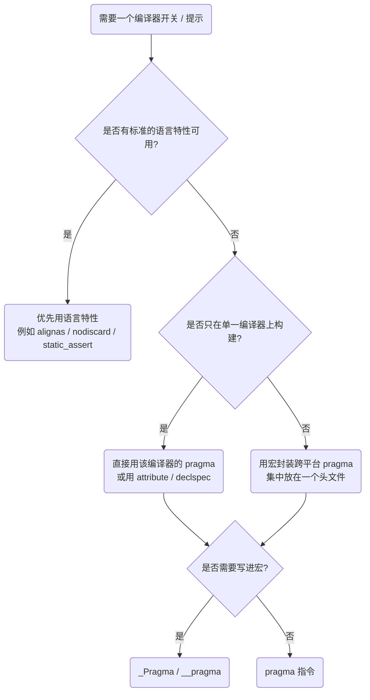

# C/C++ `#pragma` 预处理指令详解

> **一句话总结**：`#pragma` 是标准给编译器留的「后门」——任何实现不认识的内容都必须被忽略，因此它成为了在不破坏语言兼容性的前提下，向编译器下达私有指令的唯一通道。
>
> **本文约定**
>
> | 标记              | 含义                                     |
> | ----------------- | ---------------------------------------- |
> | **MSVC**          | Microsoft Visual C++ 专有                |
> | **GCC**           | GNU Compiler Collection 专有             |
> | **Clang**         | Clang/LLVM 专有                          |
> | **通用**          | 三大编译器均支持（行为可能仍有细微差别） |
> | **C89/C99/C++11** | 标准引入的版本                           |
>
> **阅读路径**：若只想「会用」，读第一至第三部分；若要搞清「为什么这样写」和工程化封装，读第四至第八部分。
>
> **原文来源**：Naruto_Qing，《C++中#pragma用法详解》，CSDN，2017。<https://blog.csdn.net/piaoxuezhong/article/details/58586014>
> 本文在原文基础上做了大幅扩充、按体系重排，并修正了若干技术性错误（见 [第九部分 `#s43`](#s43)）。

---

<a id="s1"></a>

## 目录

- [第一部分　基础认知：`#pragma` 究竟是什么](#s2)
  - [1.1 一条最简单的 pragma](#s3)
  - [1.2 标准怎么说（关键的一句原文）](#s4)
  - [1.3 书写细节与常见笔误](#s5)
  - [1.4 编译器遇到不认识的 pragma 会怎样](#s6)
  - [1.5 `_Pragma` 与 `__pragma`：让 pragma 走进宏](#s7)
  - [1.6 该不该用 pragma：三种方案的取舍](#s8)
- [第二部分　速查表](#s9)
  - [按用途分类](#s10)
  - [与命令行选项的对应关系](#s11)
- [第三部分　高频 pragma 逐条精讲（基础篇）](#s12)
  - [3.1 `#pragma once`](#s13)
  - [3.2 `#pragma message`](#s14)
  - [3.3 `#pragma pack`](#s15)
  - [3.4 `#pragma comment`（MSVC）](#s16)
  - [3.5 `#pragma warning`（MSVC）](#s17)
  - [3.6 GCC / Clang 的诊断控制](#s18)
- [第四部分　控制目标文件的布局（进阶篇）](#s19)
  - [4.1 `#pragma data_seg`](#s20)
  - [4.2 `#pragma bss_seg`](#s21)
  - [4.3 `#pragma const_seg`](#s22)
  - [4.4 `#pragma alloc_text`](#s23)
  - [4.5 `#pragma code_seg`](#s24)
  - [4.6 `#pragma section`](#s25)
  - [4.7 `#pragma init_seg`](#s26)
- [第五部分　控制优化与代码生成](#s27)
  - [5.1 MSVC：`#pragma optimize`](#s28)
  - [5.2 MSVC：内联与 intrinsics 相关](#s29)
  - [5.3 Clang：循环优化提示](#s30)
  - [5.4 GCC：逐函数调整优化级别与指令集](#s31)
  - [5.5 OpenMP](#s32)
  - [5.6 其他编译器提示指令](#s33)
- [第六部分　告警治理的工程化做法](#s34)
  - [防线一：用 isystem / external 隔离第三方代码](#s35)
  - [防线二：统一的安全压制宏](#s36)
  - [防线三：CI 里的告警基线](#s37)
- [第七部分　跨平台封装与实战模板](#s38)
  - [7.1 `suppress_warnings.h`：全编译器通用的告警压制宏](#s39)
  - [7.2 跨平台的紧凑结构体宏](#s40)
  - [7.3 编译期自检宏](#s41)
- [第八部分　陷阱清单](#s42)
- [第九部分　勘误与原文差异说明](#s43)
- [附录　参考资料](#s44)

---

<a id="s2"></a>

## 一、第一部分：基础认知——`#pragma` 究竟是什么

<a id="s3"></a>

### 1.1 一条最简单的 pragma

```c
#pragma once
```

这行指令告诉编译器：**在整个编译过程中，本文件只允许被包含一次**。

它之所以存在，是为了解决 C/C++ 头文件反复包含导致的重复定义问题。之所以必须写成 `#pragma` 而不是语言原生语句，原因是：

- 头文件是否需要「去重」属于**编译器/文件系统层面**的事情，与语言语义无关；
- 语言标准不希望为某个平台、某种构建方式的行为背书；
- 于是标准留了一个口子——`#pragma`，把话柄交给实现。

一句话概括它的定位：

> **`#pragma` = 标准化的语法外壳 + 完全由实现定义的内容。**

<a id="s4"></a>

### 1.2 标准怎么说（关键的一句原文）

C++20 标准 `[cpp.pragma]/1` 的原文（英文原文，建议记住）：

> A preprocessing directive of the form `# pragma pp-tokens_opt new-line` causes the implementation to behave in an **implementation-defined** manner. The behavior might cause translation to fail or cause the translator or the resulting program to behave in a **non-conforming** manner. Any pragma that is not recognized by the implementation is **ignored**.

拆成三条要点：

1. **实现自定义**：每个编译器可以自行解释 pragma 的含义。MSVC 的 `#pragma comment`、GCC 的 `#pragma GCC target`、Clang 的 `#pragma clang loop` 互不通用，这是被标准允许的。
2. **允许「捣乱」**：标准明确承认，pragma 可能让翻译失败，甚至让程序表现出**不符合标准**的行为（例如 `#pragma pack(1)` 会让结构体布局偏离常规对齐规则）。换句话说，用了 pragma 出了事，别指望标准来兜底。
3. **未知即忽略**：不认识的 pragma **必须被忽略**，不得报错。这是 pragma 能跨平台共存的根基，也是它最大的隐患（见 1.4）。

C 语言的对应条款（C99 6.10.6）内容基本一致，并额外规定：**以 `STDC` 开头的 pragma 不得由实现随意解释**，标准保留了 `#pragma STDC` 命名空间。C99 由此定义了三组浮点相关的标准 pragma：

| 标准 pragma                                          | 作用                                              |
| ---------------------------------------------------- | ------------------------------------------------- |
| `#pragma STDC FP_CONTRACT on \| off \| default`      | 是否允许把 `a*b+c` 融合成一条 FMA 指令            |
| `#pragma STDC FENV_ACCESS on \| off \| default`      | 是否允许访问浮点环境（舍入模式、异常标志）        |
| `#pragma STDC CX_LIMITED_RANGE on \| off \| default` | 复数运算是否可以使用简化公式（可能引入溢出/除零） |

> **注意**：C++ 标准本身**没有**定义任何一条必备 pragma。上表中的三组属于 C 的内容，多数 C++ 编译器为兼容性起见也支持，但不可假定必然生效。

<a id="s5"></a>

### 1.3 书写细节与常见笔误

```c
#pragma Para          // 正确
#pragma once          // 正确
# pragma once         // 也正确：# 与 pragma 之间允许空白
#Pragma once          // 错误：预处理指令名区分大小写
#pragma once;         // 危险：分号不属于指令，会被当成空语句留下来
```

需要记住的规则：

- **不写分号**：pragma 以换行结束，不是语句。

- **小写**：历史上 `#pragma` 全部小写；某些编译器容许大小写变体，但不要依赖。

- **行内宏会被展开**：pragma 的参数会经过宏替换。因此下面这种写法是完全合法的：

  ```c
  #pragma message("Compiled on " __DATE__ " at " __TIME__)
  ```

  其中 `__DATE__`、`__TIME__` 被展开后又与周围的字面量自动拼接。

- **可以续行**：过长时可用反斜杠 `\` 续行，与其他预处理指令一致。

- **`\#pragma` 是排版需要才出现的转义**：原文为了在富文本里显示而写成了 `\#pragma`，实际代码里**不能**带反斜杠。

<a id="s6"></a>

### 1.4 编译器遇到不认识的 pragma 会怎样

这是 pragma 最容易坑人的地方：

| 编译器      | 默认行为                                                     |
| ----------- | ------------------------------------------------------------ |
| GCC / Clang | 发出 `-Wunknown-pragmas` 警告（**默认开启**），然后忽略      |
| MSVC        | 发出 **C4068**（unknown pragma），默认通常不显示，可用 `/w14068` 显式打开 |

于是产生三类典型事故：

1. **指令被静默吞掉，行为悄悄改变**。最典型的是 OpenMP：

   ```c
   #pragma omp parallel for
   for (int i = 0; i < n; ++i) { /* ... */ }
   ```

   如果忘记加 `-fopenmp` / `/openmp`，这条 pragma 会被忽略，循环**仍然正确编译、正确运行，只是变成了串行**。功能不错，性能没了。

2. **编译器理解的方向不一致**。例如 `#pragma pack(push, 8)` 之后某些工具的清理顺序若和 MSVC 不完全一致，结构体布局就会偏差。

3. **在 `-Werror` 的 CI 里反而编译失败**。同一个 codebase，本地 GCC 能过（因为它认识 GCC pragma，别的 pragma 只是警告），换到严格模式下那条警告就变成错误了。

> **工程建议**：把第三方 pragma 集中写在 `compiler_compat.h` 之类单一头文件中，并用宏隔离；不要把裸 pragma 散落在业务代码里。

<a id="s7"></a>

### 1.5 `_Pragma` 与 `__pragma`：让 pragma 走进宏

`#pragma` 是**预处理指令**，不能直接出现在宏体中：

```c
#define HEADER_GUARD  #pragma once   // 非法：# 在宏定义里是字符串化运算符
```

为此标准提供了 **`_Pragma` 运算符**（C99 / C++11 引入）：

```c
_Pragma("once")                      // 等价于 #pragma once
_Pragma("GCC diagnostic ignored \"-Wunused-variable\"")
```

规则：参数是**字符串字面量**（或可 stringize 的宏），处理器会去掉最外层的字符串界定（`L"..."` 同理），把内容当作 pragma 处理。因为反斜杠需要转义，通常配合 stringize 使用：

```c
#define DO_PRAGMA(x) _Pragma(#x)
#define DISABLE_GCC_WARNING(opt) DO_PRAGMA(GCC diagnostic ignored opt)

DISABLE_GCC_WARNING(-Wunused)        // -> _Pragma("GCC diagnostic ignored -Wunused")
```

MSVC 提供了自己的关键字 **`__pragma`**，好处是不需要处理引号转义：

```c
#define DISABLE_MSVC_WARNING(code) __pragma(warning(disable: code))
DISABLE_MSVC_WARNING(4996)
```

三者对比：

| 形式             | 引入时间           | 可用于宏 | 引号/转义     | 说明                                |
| ---------------- | ------------------ | -------- | ------------- | ----------------------------------- |
| `#pragma xxx`    | C89 起（事实标准） | 否       | 无            | 最直观，但写不进宏                  |
| `_Pragma("xxx")` | C99 / C++11        | 是       | 需要转义 `\"` | 跨编译器可移植的标准写法            |
| `__pragma(xxx)`  | MSVC 扩展          | 是       | 直接写        | Clang 在 `-fms-extensions` 下也支持 |

> **注意**：Clang 也支持 `_Pragma`，所以写跨平台宏时优先用 `_Pragma`，只在 MSVC 分支里用 `__pragma`。

<a id="s8"></a>

### 1.6 该不该用 pragma：三种方案的取舍

同一件事（例如「禁止某个告警」「让结构体紧凑排布」）通常有三条路可走，选择顺序建议如下：



对比总结：

| 方案                           | 优点                       | 缺点                                     | 典型场景                                  |
| ------------------------------ | -------------------------- | ---------------------------------------- | ----------------------------------------- |
| 语言标准特性                   | 可移植、IDE 友好           | 覆盖面窄                                 | `alignas`、`[[deprecated]]`、`[[likely]]` |
| `__attribute__` / `__declspec` | 绑定到具体声明，作用域清晰 | 仍是编译器扩展                           | 函数/变量级优化、可见性控制               |
| `#pragma`                      | 覆盖面最广、可文件级作用   | 作用域通常是「从这里到文件末」，容易外泄 | 段布局、告警压制、翻译单元级优化          |

一句话原则：**能绑定到具体声明就用属性，必须用文件级或编译器级开关时才用 pragma，并且一定配 delimit（push/pop）。**

---

<a id="s9"></a>

## 二、第二部分：速查表

<a id="s10"></a>

### 按用途分类

| 类别           | 指令                                                  | 编译器         | 一句话说明                           |
| -------------- | ----------------------------------------------------- | -------------- | ------------------------------------ |
| **包含控制**   | `#pragma once`                                        | 通用           | 当前文件只编译一次                   |
|                | `#pragma hdrstop`                                     | MSVC           | 指定预编译头文件截止点               |
| **诊断输出**   | `#pragma message("...")`                              | 通用           | 编译时不中断地打印信息               |
|                | `#pragma warning(...)`                                | MSVC           | 精细控制告警行为                     |
|                | `#pragma GCC diagnostic` / `#pragma clang diagnostic` | GCC/Clang      | 同上，GCC/Clang 版                   |
|                | `#pragma region` / `endregion`                        | MSVC           | 编辑器折叠区域（无编译语义）         |
| **数据布局**   | `#pragma pack(n)`                                     | 通用           | 结构体成员紧凑对齐                   |
|                | `#pragma data_seg("...")`                             | MSVC           | 已初始化数据放入指定段               |
|                | `#pragma bss_seg("...")`                              | MSVC           | 未初始化数据放入指定段               |
|                | `#pragma const_seg("...")`                            | MSVC           | 常量数据放入指定段                   |
|                | `#pragma code_seg("...")`                             | MSVC           | 函数代码放入指定段                   |
|                | `#pragma alloc_text("seg", f1, f2)`                   | MSVC           | 将指定函数的代码放入指定段           |
|                | `#pragma section(...)`                                | MSVC           | 先创建具备属性的段，再被上面几条引用 |
| **链接控制**   | `#pragma comment(lib, "...")`                         | MSVC           | 自动链接指定库                       |
|                | `#pragma comment(linker, "...")`                      | MSVC           | 向链接器传命令行开关                 |
|                | `#pragma detect_mismatch("k", "v")`                   | MSVC           | 链接时校验库版本一致性               |
| **优化控制**   | `#pragma optimize(off/on)`                            | MSVC           | 关闭/恢复优化（便于调试）            |
|                | `#pragma GCC optimize("O3")`                          | GCC            | 针对后续函数调整优化级别             |
|                | `#pragma GCC target("avx2")`                          | GCC            | 针对后续函数调整指令集               |
|                | `#pragma clang loop vectorize(...)`                   | Clang          | 向量化/展开提示                      |
|                | `#pragma omp parallel for`                            | 通用（需开关） | OpenMP 并行化                        |
| **初始化顺序** | `#pragma init_seg(...)`                               | MSVC (C++)     | 控制全局对象的构造顺序               |
| **其他**       | `#pragma intrinsic(...)` / `function(...)`            | MSVC           | 内联 intrinsics 或强制函数调用       |
|                | `#pragma deprecated(f)`                               | MSVC           | 标记函数为已废弃                     |
|                | `#pragma pointers_to_members(...)`                    | MSVC           | 控制成员指针表示方式（影响 ABI）     |

<a id="s11"></a>

### 与命令行选项的对应关系

| pragma                           | 等价命令行                            |
| -------------------------------- | ------------------------------------- |
| `#pragma pack(n)`                | MSVC `/Zp n`，GCC `-fpack-struct`     |
| `#pragma optimize("s", on)`      | MSVC `/Os`                            |
| `#pragma warning(default: 4996)` | MSVC `/w34996`（把单个告警设为 3 级） |
| `#pragma comment(lib, "x")`      | MSVC 链接器输入 `x.lib`               |
| `#pragma omp parallel`           | GCC/Clang `-fopenmp`，MSVC `/openmp`  |

---

<a id="s12"></a>

## 三、第三部分：高频 pragma 逐条精讲（基础篇）

<a id="s13"></a>

### 3.1 `#pragma once`（通用但非标准）

```c
// my_header.h
#pragma once

struct Config { int width; int height; };
```

**语义**：编译器记录该文件的物理路径（更准确说是其 `(dev, inode)` 或其他唯一标识），重复 `#include` 时直接跳过。

#### 与 include guard 的对比

```c
#ifndef MY_HEADER_H
#define MY_HEADER_H
/* ... */
#endif
```

| 维度                               | `#pragma once`                                 | include guard            |
| ---------------------------------- | ---------------------------------------------- | ------------------------ |
| 标准化                             | 非标准（但被三大编译器普遍支持）               | 纯标准写法               |
| 书写成本                           | 一行，不会因改名而失效                         | 三行，宏名易冲突/写错    |
| 编译速度                           | 通常更快（编译器无需重复打开文件）             | 略慢（需重复读入并跳过） |
| 硬链接/符号链接同一份文件          | **可能被当成两个文件**（同一份内容的两条路径） | 不受影响                 |
| NFS / 网络文件系统、大小写敏感问题 | 有历史坑                                       | 不受影响                 |
| 宏名污染                           | 无                                             | 有                       |

**结论**：现代项目推荐**两者同时用**（`pragma once` 提速，guard 兜底），这是 Google、LLVM 等大型项目也采用的稳妥做法：

```c
#pragma once
#ifndef PROJ_UTIL_CONFIG_H_
#define PROJ_UTIL_CONFIG_H_
/* ... */
#endif  // PROJ_UTIL_CONFIG_H_
```

> **注意**：只有当某个头文件**同一份源文件里通过不同路径被包含两次**时（例如通过符号链接的两个别名），`pragma once` 才会失效。普通项目几乎遇不到，但一旦遇到，症状是极其难以理解的「redefinition」错误。

---

<a id="s14"></a>

### 3.2 `#pragma message`（通用但非标准）

**语法**

```c
#pragma message(messagestring)
```

**语义**：把一段文本写到编译器的标准输出，**不中断编译**。它最大的价值是：在编译期把宏的实际取值「喊」出来——这是排查构建配置问题最快的手段。

#### 典型用法一：编译配置回显

```c
#pragma message("Compiling " __FILE__)
#pragma message("Last modified on " __TIMESTAMP__)   // MSVC 专有宏
#pragma message("Build date: " __DATE__ " at " __TIME__)
```

#### 典型用法二：条件编译里提示

```c
#if defined(_MSC_VER)
    #pragma message("[info] MSVC toolchain detected")
#elif defined(__clang__)
    #pragma message("[info] Clang toolchain detected")
#elif defined(__GNUC__)
    #pragma message("[info] GCC toolchain detected")
#endif

#if _DEBUG
    #pragma message("[warn] building DEBUG configuration")
#endif
```

#### 典型用法三：和 warning 联合作为 TODO 提示

```c
#if defined(_MSC_VER)
    #define TODO(msg) __pragma(message(__FILE__ "(" TO_STR(__LINE__) "): TODO: " msg))
#endif
```

> **注意**：`messagestring` 可以是能展开为字符串字面量的宏，也可以自由组合。它在 MSVC「输出」窗口、GCC/Clang 的 stderr 行中出现，会被当作**普通 note**，不会计入警告计数。

---

<a id="s15"></a>

### 3.3 `#pragma pack`（通用但非标准）

这可能是日常**最容易踩坑、也最有实用价值**的一条 pragma。

#### 语法

```c
#pragma pack(n)                          // 把对齐边界设为 n
#pragma pack()                           // 恢复为命令行设定（默认 /Zp8）
#pragma pack(push[, n])                  // 保存当前值，可选地设新值
#pragma pack(pop)                        // 恢复上一次 push 的值
#pragma pack(push, identifier[, n])      // 带标识符的 push（MSVC 专有）
#pragma pack(pop, identifier)            // 弹出直到遇到该标识符（MSVC 专有）
```

`n` 只能取 **1、2、4、8、16**。

#### 语义精讲

规则是：**每个成员的对齐方式 = min(声明时指定的 n, 该成员类型的自然对齐)**。

```c
#pragma pack(push, 1)          // 记住当前值，设为 1 字节对齐
struct WirePacket {
    char     cmd;              // 偏移 0，占 1 字节
    int32_t  length;           // 偏移 1（而不是默认的 4！）
    uint16_t crc;              // 偏移 5
};                             // sizeof == 7
#pragma pack(pop)              // 恢复调用前的对齐设置
```

如果去掉 pack，默认 `/Zp8`（或 GCC 的相应默认）下：

```c
struct WirePacket {            // 未 pack
    char     cmd;              // 偏移 0
    /* 3 字节填充 */
    int32_t  length;           // 偏移 4
    uint16_t crc;              // 偏移 8
    /* 2 字节填充 */
};                             // sizeof == 12
```

这正是网络协议、文件格式（BMP 位图头、WAV 头）、寄存器映射结构体必须用 `#pragma pack(1)` 的原因：**磁盘和网线上的字节序列不会迁就编译器的对齐规则。**

#### 头文件的正确写法（必写 push/pop）

```c
// wire_protocol.h
#pragma once

#pragma pack(push, 1)
#ifdef __cplusplus
extern "C" {
#endif

struct WirePacket {
    uint8_t  magic;
    uint32_t seq;
    uint16_t payload_len;
};

#ifdef __cplusplus
}
#endif
#pragma pack(pop)              // 若忘了这一行，后面所有结构体的布局全被改掉！

static_assert(sizeof(struct WirePacket) == 7, "WirePacket layout changed");
```

> **血泪教训**：`#pragma pack(n)` 是一条**作用域一直延续到文件末尾（或下一个 pack）**的指令。在头文件里裸写 `#pragma pack(1)` 而不恢复，会让所有间接包含该头文件的代码 ABI 静默改变，表现为：定义完全一致的两个结构体，在一个 TU 里是 12 字节，在另一个 TU 里是 7 字节。这类 bug 通常只在偶发的内存踩踏中出现，极难定位。

#### 三大编译器的差异

| 写法                                   | MSVC       | GCC                                          | Clang                               |
| -------------------------------------- | ---------- | -------------------------------------------- | ----------------------------------- |
| `#pragma pack(push, n)` / `(pop)`      | 支持       | 支持                                         | 支持                                |
| `#pragma pack(push, name, n)` 带标识符 | 支持       | **不支持**                                   | 支持（MS 兼容模式）                 |
| 默认对齐值                             | `/Zp8`     | 由 ABI 决定（通常为目标字长）                | 同 ABI                              |
| 等价的属性写法                         | 无直接对应 | `__attribute__((packed))` / `((aligned(n)))` | 同 GCC，另有 `__declspec(align(n))` |

#### 更现代的替代思路

`pack` 会破坏成员的自然对齐，导致 CPU 需要额外的字节读取周期（甚至在某些架构上触发对齐异常）。更可控的做法是**不压缩结构体，而是在序列化时手动逐字段写字节流**：

```c
void encode(const WirePacket& p, uint8_t* out) {
    out[0] = p.magic;
    out[1] = p.seq        & 0xFF;
    out[2] = (p.seq >> 8) & 0xFF;
    /* ... */
}
```

这样结构体在内存中保持自然对齐，只有跨进程/跨网络的那一段是紧凑的。**这是推荐用于新代码的方案**，`#pragma pack` 主要用于兼容既有的二进制协议。

---

<a id="s16"></a>

### 3.4 `#pragma comment`（MSVC）

**语法**

```c
#pragma comment(comment-type [, "commentstring"])
```

**语义**：把一条记录嵌入到目标文件（`.obj`）中，由链接器在链接时读取并执行相应动作。

| `comment-type` | 作用                                                  | 是否常用   |
| -------------- | ----------------------------------------------------- | ---------- |
| `lib`          | 自动加入库依赖，链接器按当前目录 → `LIB` 环境变量搜索 | **极常用** |
| `linker`       | 向链接器传递任意命令行开关                            | **常用**   |
| `compiler`     | 把编译器名与版本号写入目标文件                        | 少见       |
| `user`         | 写入任意注释文本                                      | 少见       |
| `exestr`       | 嵌入可执行串，**已废弃**，不要使用                    | 不使用     |

#### 典型用法一：自动链接库（Windows 下最常见的写法）

```c
// 等价于在项目属性里给链接器加上 winmm.lib
#pragma comment(lib, "winmm.lib")
#pragma comment(lib, "ws2_32.lib")     // Winsock
#pragma comment(lib, "user32.lib")
```

好处是：**库的使用者不需要手动配置链接器输入**，包含头文件即可。OpenCV、Boost 在 Windows 上的 `config/auto_link.hpp` 就是这个思路的成熟封装：

```c
#if defined(_MSC_VER)
#  if defined(_WIN64)
#    pragma comment(lib, "opencv_core455.lib")
#  else
#    pragma comment(lib, "opencv_core455d.lib")   // d 后缀 = Debug 版
#  endif
#endif
```

#### 典型用法二：向链接器传开关

```c
// 把某个自定义段设为可读可写可共享（DLL 间共享数据）
#pragma comment(linker, "/SECTION:.shared,RWS")

// 修改子系统，避免手写 SUBSYSTEM 配置
#pragma comment(linker, "/SUBSYSTEM:CONSOLE")

// 提高某段的对齐粒度
#pragma comment(linker, "/ALIGN:4096")
```

#### 典型用法三：用宏做 Diamond / 版本标记

```c
#define STRINGIFY2(x) #x
#define STRINGIFY(x)  STRINGIFY2(x)
#pragma comment(user, "Built " __DATE__ " " __TIME__ " with MSVC " STRINGIFY(_MSC_VER))
```

> **注意**：`#pragma comment` 是 MSVC 专有。GCC / Clang 会给出 `-Wunknown-pragmas` 警告后忽略。跨平台代码必须套 `#if defined(_MSC_VER)`。

---

<a id="s17"></a>

### 3.5 `#pragma warning`（MSVC）

**语法**

```c
#pragma warning(warning-specifier : warning-number-list [, warning-specifier : warning-number-list ...])
#pragma warning(push[, n])
#pragma warning(pop)
```

#### `warning-specifier` 取值

| 值                    | 含义                                                        |
| --------------------- | ----------------------------------------------------------- |
| `once`                | 指定编号的告警只显示一次（适合刷屏型告警）                  |
| `default`             | 恢复为编译器默认行为（最常用，**用于 pop 之外的精确恢复**） |
| `1` / `2` / `3` / `4` | 把指定告警设为相应告警等级                                  |
| `disable`             | 完全不显示                                                  |
| `error`               | 把这个告警当成**错误**处理（配合 `-WX` 风格的严格构建）     |
| `suppress`            | 只压制**紧邻的下一行**（需要 MSVC 2005+）                   |

#### 一条指令里写多个规则

```c
#pragma warning(disable : 4507 34; once : 4385; error : 164)
```

等价于：

```c
#pragma warning(disable : 4507)     // 不显示 C4507
#pragma warning(disable : 34)       // 不显示 C34
#pragma warning(once : 4385)        // C4385 只显示一次
#pragma warning(error : 164)        // C164 提升为错误
```

#### `push` / `pop`：作用域管理的核心

```c
#pragma warning(push)               // 保存当前全部告警状态
#pragma warning(disable : 4705)
#pragma warning(disable : 4706)
#pragma warning(disable : 4707)
// ... 若干会引起上述告警的代码 ...
#pragma warning(pop)                // 一键恢复上面所有改动
```

带等级的形式：

```c
#pragma warning(push, 3)            // 保存状态，并把全局告警等级降到 /W3
// Declarations / definitions ...
#pragma warning(pop)                // 恢复原等级与全部原状态
```

**这是头文件里必须做的事情**——你的头文件不应该改变使用者的告警配置：

```c
// thirdparty_wrapper.h
#pragma once
#pragma warning(push, 3)
#pragma warning(disable : 4996)     // 抑掉第三方头里的 deprecation

#include <thirdparty_header.h>

#pragma warning(pop)
```

#### `suppress`：精确到一行的压制

```c
int compute() {
    char* p = reinterpret_cast<char*>(some_int_ptr);   // 只这一行不想看告警
    #pragma warning(suppress : 4312)                   // 仅作用于下一句
    return 0;
}
```

#### 一个重要限制

> **涉及代码生成的告警（编号 > 4699），`#pragma warning` 只在函数定义之外生效。** 写在函数体内的高编号告警压制会被忽略。

因此正确的位置是：

```c
int a;

#pragma warning(disable : 4705)     // 正确：写在函数定义外
void func()
{
    a;                              // 本来会触发 C4705
}
#pragma warning(default : 4705)     // 及时恢复
```

---

<a id="s18"></a>

### 3.6 GCC / Clang 的诊断控制

GCC / Clang 的对应语法完全不同，等价写法如下：

```c
#pragma GCC diagnostic push                       // 等价于 MSVC warning(push)
#pragma GCC diagnostic ignored "-Wunused-variable"
#pragma GCC diagnostic ignored "-Wdeprecated-declarations"
#pragma GCC diagnostic error   "-Wswitch"         // 提升为错误
#pragma GCC diagnostic warning "-Wall"            // 强制为警告

#include <thirdparty_header.h>

#pragma GCC diagnostic pop                        // 等价于 MSVC warning(pop)
```

要点：

| 事项                      | 说明                                                         |
| ------------------------- | ------------------------------------------------------------ |
| 选项名前要带 `-`          | `"-Wunused"`，不能写成 `"unused"`                            |
| 可用 `push`/`pop`         | 与 MSVC 语义一致                                             |
| 也支持 `-Werror=xxx` 形式 | `#pragma GCC diagnostic ignored "-Werror=xxx"` 可取消 `-Werror` 的升级 |
| Clang 的变体              | 可用 `#pragma clang diagnostic ...`，Clang 同时兼容 `#pragma GCC diagnostic` |
| 源文件级降噪              | `#pragma GCC system_header`（放在自己的头文件开头，令本文件内的告警按系统头文件对待） |

> **已知限制**：部分诊断（尤其是模板实例化、内联函数展开产生的告警）是在**翻译单元处理的后期甚至末尾**才发出的，`push`/`pop` 包裹未必能完整覆盖。遇到个别漏网的诊断，可在文件开头先 `#pragma GCC diagnostic ignored`，把 `pop` 推迟到文件末尾；或直接用命令行 `-isystem` 把第三方目录标记为系统头。

#### 系统头文件替代方案（比 pragma 更干净）

```bash
# GCC / Clang：把第三方目录标记为系统头，其中的告警自动屏蔽
g++ -std=c++17 -isystem ./third_party/include main.cpp

# MSVC（VS 2017 15.6+）
cl /experimental:external /external:anglebrackets /external:W0 main.cpp
```

---

<a id="s19"></a>

## 四、第四部分：控制目标文件的布局（进阶篇）

这一组的共同主题是：**让代码/数据落在 `.obj` 的具体位置，从而跨节自定义加载、共享和内存属性**。它们几乎全是 MSVC 专有，且只有在 Windows 驱动、DLL、嵌入式等场景里才会用到。

<a id="s20"></a>

### 4.1 `#pragma data_seg`：指定已初始化数据的段

```c
#pragma data_seg("MY_DATA")
int g_counter = 0;          // 会被放进 MY_DATA 段
#pragma data_seg()          // 恢复默认段（不带参数的写法）
```

#### 经典用途：在 DLL 的多个映射实例间共享数据

```c
#pragma data_seg(".shared")
int g_shared_counter = 0;   // 必须是「已初始化」的变量
char g_shared_buf[256] = { 0 };
#pragma data_seg()
#pragma data_seg()          // 有的写法还会再补一行，确保复位

// 让 .shared 段具备 Read/Write/Shared 三重属性
#pragma comment(linker, "/SECTION:.shared,RWS")
```

> **两个必须知道的坑**
>
> 1. **只有已初始化的变量才会进入 `data_seg`**。未初始化的全局/静态变量会被分配到 `.bss`，不会进入你指定的段。这就是 `#pragma bss_seg` 存在的原因。
> 2. 该 pragma **不包含位置信息**，只说明「从这里开始的变量去哪个段」。因此它必须写在变量定义之前。
> 3. 未初始化的全局/静态变量不会进入 `data_seg`，而会被分配到 `.bss`。这是 `#pragma bss_seg` 存在的原因（见 4.2）。

<a id="s21"></a>

### 4.2 `#pragma bss_seg`：未初始化数据的段

```c
#pragma bss_seg("MY_BSS")
char g_large_buffer[1024 * 1024];   // 未初始化，落在 MY_BSS
#pragma bss_seg()
```

<a id="s22"></a>

### 4.3 `#pragma const_seg`：常量数据的段

```c
#pragma const_seg("MY_RODATA")
const char* const kAppName = "MyApp";
#pragma const_seg()
```

用途是把常量集中到一个只读段，便于做完整性校验、减少 RAM 占用（嵌入式）或统一配合分页策略。

> 第二个参数 `section-class` 是兼容 Visual C++ 2.0 之前版本的遗留要素，**现代 MSVC 直接忽略**，不要依赖。

<a id="s23"></a>

### 4.4 `#pragma alloc_text`：把指定函数的代码放进指定段

```c
#pragma alloc_text("textsection", function1, function2, ...)
```

规则极其严格：

1. 必须出现在**函数声明之后、函数定义之前**；
2. 不能写在函数内部；
3. 只作用于**以 C 连接方式声明的函数**——用于 C++ 成员函数或重载函数会产生编译错误；
4. 引用的函数必须和 `#pragma` 位于**同一个模块**；否则，某个未定义函数被编译到别的段这类错误不一定会被捕获，程序表面上还能跑，只是函数不在预期的段里；
5. 段名必须用**双引号**括起来。

```c
// 声明在前
extern "C" void LegacyRoutine(void);

// pragma 夹在中间 ——这是唯一合法的位置
#pragma alloc_text("MY_TEXT", LegacyRoutine)

// 定义在后
extern "C" void LegacyRoutine(void) {
    /* ... */
}
```

> **现实意义**：源自 Windows 3.x / 16 位的段式 memory model，主要通过「按需把不常用的代码段换出内存」来缓解内存压力。现代 64 位平坦地址空间下几乎用不到，仅在某些特殊情况（需要精确控制分页、驱动初始化代码 `PAGE`/`INIT` 段）还有价值。

<a id="s24"></a>

### 4.5 `#pragma code_seg`：指定函数代码段的默认值

```c
#pragma code_seg(["section-name"[, "section-class"]])
#pragma code_seg(push[, ident][, "segment-name"[, "segment-class"]])
#pragma code_seg(pop[, ident])
```

不带参数使用则恢复编译开始时的状态：

```c
#pragma code_seg("MY_TEXT")     // 后面的函数去 MY_TEXT 段
void f() {}
void g() {}
#pragma code_seg()              // 恢复默认代码段
```

WDK 驱动开发中的典型写法：

```c
#pragma alloc_text(PAGE, DriverDispatch)   // 分页代码，可换出
#pragma alloc_text(INIT, DriverEntry)      // 初始化代码，Init 后可丢弃
```

<a id="s25"></a>

### 4.6 `#pragma section`：先定义具备属性的段

`data_seg`/`code_seg` 只管「放哪个段」，而段的读写属性要用 `section` 配合链接器开关来配：

```c
#pragma section(".shared", read, write, shared)
__declspec(allocate(".shared")) int g_shared = 0;
```

<a id="s26"></a>

### 4.7 `#pragma init_seg`：C++ 全局对象的构造顺序

```c
#pragma init_seg({ compiler | lib | user | "section-name" [, func-name] })
```

**为什么需要它**：全局静态对象的初始化可能包含可执行代码，如果对象 A 的构造函数依赖对象 B（比如在 CRT、第三方库里），而构造顺序不确定，就会出现「静态初始化顺序灾难（Static Initialization Order Fiasco）」。在 DLL / 静态库场景下尤其危险。

三个预定义关键字的构造顺序：

| 级别             | 含义               | 典型使用者                                |
| ---------------- | ------------------ | ----------------------------------------- |
| `compiler`       | 最先构造           | Microsoft C 运行库/基础工具开工所需的对象 |
| `lib`            | 其次               | 第三方类库供应商                          |
| `user`           | 再次（**默认值**） | 用户代码                                  |
| `"section-name"` | 之后               | 用户自定义段                              |

带函数名重载形式：

```c
#pragma init_seg(".mycrt$", MyInitAll)   // CRT 调用 MyInitAll 完成该段的初始化
```

> **两个重要提醒**
>
> 1. **同一个自定义段内部，多个对象的构造顺序是不确定的**，不要依赖它们的相对次序。
> 2. 现代替代方案优先：**消除跨 TU 的全局依赖**。改用 C++11 起保证线程安全的函数局部静态变量（`T& instance() { static T obj; return obj; }`），或显式惰性初始化。

---

<a id="s27"></a>

## 五、第五部分：控制优化与代码生成

<a id="s28"></a>

### 5.1 MSVC：`#pragma optimize`

```c
#pragma optimize("[optimization-list]", {on | off})
```

**两个硬性约束**：

1. 必须写在**函数之外**；
2. 从该 pragma 出现后**第一个函数定义**开始生效。

`optimization-list` 的取值与 `/O` 命令行选项同宗：

| 字母 | 优化类型                                            |
| ---- | --------------------------------------------------- |
| `a`  | 假定没有别名（assume no aliasing）                  |
| `g`  | 允许全局优化                                        |
| `p`  | 增强浮点一致性                                      |
| `s`  | 指定**更短**的机器代码序列（优化体积）              |
| `t`  | 指定**更快**的机器代码序列（优化速度）              |
| `w`  | 假定函数调用中不存在别名                            |
| `y`  | 在程序堆栈中生成框架指针（frame pointer），利于调试 |

```c
#pragma optimize("atp", on)      // 打开 a / t / p 三项优化
#pragma optimize("", off)        // 特例：空串 = 关闭全部优化
/* ... 需要精确单步调试的代码 ... */
#pragma optimize("", on)         // 恢复到命令行设定的默认值
```

> 原文提到「仅在专业版和企业版中存在」，这是 VS 6.0 时代的商业版本限制；现代 MSVC（含 Community 版）全部支持完整优化能力。

<a id="s29"></a>

### 5.2 MSVC：内联与 intrinsics 相关

```c
#pragma inline_depth(n)                // 控制内联展开的最大深度（n = 0~255），0 关闭内联
#pragma inline_recursion(on | off)     // 是否允许递归函数被内联
#pragma auto_inline(on | off)          // 关闭「由编译器自动决定的内联」
#pragma intrinsic(memcpy, memset)      // 内联展开为 CPU  intrinsics 指令
#pragma function(memcpy, memset)       // 与上相反：强制以函数调用形式出现
#pragma inline_depth(0)                // 调试时确保每条语句都可单步
```

<a id="s30"></a>

### 5.3 Clang：循环优化提示

```c
#pragma clang loop vectorize(enable)    // 促成向量化
#pragma clang loop interleave(enable)   // 循环交织
#pragma clang loop unroll(full)         // 完全展开（等价于 "#pragma unroll" 的一些形式）
#pragma clang loop unroll_count(4)      // 部分展开 4 次
```

```c
void scale(float* dst, const float* src, int n, float k) {
    #pragma clang loop vectorize(enable) interleave(enable)
    for (int i = 0; i < n; ++i) dst[i] = src[i] * k;
}
```

<a id="s31"></a>

### 5.4 GCC：逐函数调整优化级别与指令集

```c
#pragma GCC push_options
#pragma GCC optimize("O3", "unroll-loops")
#pragma GCC target("avx2,fma")
void hot_kernel(float* out, const float* in, int n);   // 这个函数按 AVX2 编译
#pragma GCC pop_options
```

相关指令：

| 指令                                           | 作用                                                         |
| ---------------------------------------------- | ------------------------------------------------------------ |
| `#pragma GCC optimize("...")`                  | 为后续函数设置优化选项                                       |
| `#pragma GCC target("...")`                    | 为后续函数设置目标 ISA                                       |
| `#pragma GCC push_options` / `pop_options`     | 保存/恢复上述设置                                            |
| `#pragma GCC reset_options`                    | 重置所有目标相关设置                                         |
| `#pragma GCC ivdep`                            | 向向量化器保证循环迭代之间无数据依赖                         |
| `#pragma GCC unroll N`                         | 建议展开 N 次（GCC 8+）                                      |
| `#pragma GCC visibility push(default)` / `pop` | 控制符号可见性，替代在每个符号上写 `__attribute__((visibility(...)))` |

<a id="s32"></a>

### 5.5 OpenMP

```c
#pragma omp parallel for schedule(dynamic, 64)
for (int i = 0; i < n; ++i) {
    heavy_compute(i);
}
```

**最大的坑**已在 1.4 说过：不开 `-fopenmp` / `/openmp` 时，所有 `#pragma omp` 会被静默忽略，程序**编译通过、结果正确、但不并行**。为此建议加编译期断言：

```c
#if !defined(_OPENMP)
    #pragma message("[warn] OpenMP is disabled, running in serial mode")
#endif
```

<a id="s33"></a>

### 5.6 其他编译器提示指令

```c
#pragma GCC warning "This code path is deprecated"   // 主动发一条警告
#pragma GCC error   "Unsupported platform"           // 主动发一条错误
#pragma region 数学工具                                // MSVC / VS Code 编辑器的折叠区
...
#pragma endregion
#pragma deprecated(old_func)                          // MSVC：标记废弃符号
#pragma detect_mismatch("libver", "1.2.3")            // MSVC：链接时检查版本串一致
```

---

<a id="s34"></a>

## 六、第六部分：告警治理的工程化做法

零散地写 `#pragma warning(disable: xxx)` 是技术债。工业界的通行做法是三条防线：

<a id="s35"></a>

### 防线一：用 isystem / external 隔离第三方代码

```bash
# 第三方代码里出现的告警一律不报，自己的代码一个也跑不掉
g++ -isystem third_party/include -Wall -Wextra -Werror src/*.cpp
```

```powershell
# MSVC 等价形式
cl /experimental:external /external:anglebrackets /external:W0 /W4 /WX src\*.cpp
```

<a id="s36"></a>

### 防线二：统一的安全压制宏

集中在一个头文件里定义，全项目复用（见 [7.1 `#s39`](#s39)）。

<a id="s37"></a>

### 防线三：CI 里的告警基线

```bash
# 先在 CI 里收集告警，逐个修复；剩下的显式登记到允许清单
g++ -Wall -Wextra -Wpedantic -c src/*.cpp 2> warnings.txt
```

原则：**压制范围越小越好，越靠单个接收点越好。** 优先级排序：

1. 修引起告警的代码（最优）；
2. `#pragma warning(suppress: n)` 压制单行；
3. `push`/`pop` 包裹一小段；
4. `disable` 后长期不复原（**禁止**）。

---

<a id="s38"></a>

## 七、第七部分：跨平台封装与实战模板

<a id="s39"></a>

### 7.1 `suppress_warnings.h`：全编译器通用的告警压制宏

```c
// suppress_warnings.h —— 全项目统一 include
#pragma once

// ============ 保存 / 恢复告警状态 ============
#if defined(_MSC_VER) && !defined(__clang__)
    #define WARNINGS_PUSH()  __pragma(warning(push))
    #define WARNINGS_POP()   __pragma(warning(pop))
    #define DISABLE_WARNING(code) __pragma(warning(disable: code))
#else
    #define DO_PRAGMA(x) _Pragma(#x)
    #define WARNINGS_PUSH()  DO_PRAGMA(GCC diagnostic push)
    #define WARNINGS_POP()   DO_PRAGMA(GCC diagnostic pop)
    #define DISABLE_WARNING(opt) DO_PRAGMA(GCC diagnostic ignored opt)
#endif

// ============ 常见告警的跨平台映射 ============
#if defined(_MSC_VER) && !defined(__clang__)
    #define DISABLE_UNUSED_VAR()      DISABLE_WARNING(4101)
    #define DISABLE_DEPRECATED()      DISABLE_WARNING(4996)
    #define DISABLE_UNSIGNED_SIGN()   DISABLE_WARNING(4244)
#elif defined(__GNUC__) || defined(__clang__)
    #define DISABLE_UNUSED_VAR()      DISABLE_WARNING("-Wunused-variable")
    #define DISABLE_DEPRECATED()      DISABLE_WARNING("-Wdeprecated-declarations")
    #define DISABLE_UNSIGNED_SIGN()   DISABLE_WARNING("-Wsign-conversion")
#endif
```

使用：

```c
#include "suppress_warnings.h"

WARNINGS_PUSH()
#include <legacy_sdk.h>
WARNINGS_POP()
```

<a id="s40"></a>

### 7.2 跨平台的紧凑结构体宏

```c
// packed.h
#pragma once

#if defined(_MSC_VER)
    #define PACKED_STRUCT_BEGIN __pragma(pack(push, 1))
    #define PACKED_STRUCT_END   __pragma(pack(pop))
    #define PACKED_ALIAS        /* MSVC 无对应属性，靠 pack 生效 */
#elif defined(__GNUC__) || defined(__clang__)
    #define PACKED_STRUCT_BEGIN /* nothing */
    #define PACKED_STRUCT_END   /* nothing */ __attribute__((packed))
    #define PACKED_ALIAS        __attribute__((packed))
#endif
```

```c
PACKED_STRUCT_BEGIN
struct PacketHeader {
    uint32_t seq;
    uint16_t len;
} PACKED_ALIAS;
PACKED_STRUCT_END

static_assert(sizeof(PacketHeader) == 6, "header layout must stay 6 bytes");
```

> `static_assert` 是这一整套写法中**性价比最高的一行**：结构体布局一旦因编译器升级或 pragma 失效而变化，它会在编译期立刻报警。

<a id="s41"></a>

### 7.3 编译期自检宏

```c
#if defined(__GNUC__) || defined(__clang__)
    #define STATIC_WARN(msg) DO_PRAGMA(message msg)
#elif defined(_MSC_VER)
    #define STATIC_WARN(msg) __pragma(message(msg))
#endif

#if SIZE_MAX < UINT64_MAX
    STATIC_WARN("This TU expects 64-bit size_t")
#endif
```

---

<a id="s42"></a>

## 八、第八部分：陷阱清单

按「踩到的概率 × 排查成本」排序：

| #    | 陷阱                                                         | 后果                                     | 规避方法                                                     |
| ---- | ------------------------------------------------------------ | ---------------------------------------- | ------------------------------------------------------------ |
| 1    | `#pragma pack` 写了 `push` 忘了 `pop`（或反包含顺序错乱）    | 结构体 ABI 静默改变，偶发内存踩踏        | 头文件里必须成对出现；配合 `static_assert(sizeof)`           |
| 2    | OpenMP pragma 缺 `-fopenmp` / `/openmp`                      | 编译通过、结果正确、性能暴跌             | 加 `#if !defined(_OPENMP)` 编译期提示                        |
| 3    | 在头文件里裸写 `#pragma warning(disable: n)` 不恢复          | 污染所有使用者的告警配置，掩盖真正的 bug | 一律 `push`/`pop` 成对包裹                                   |
| 4    | 把 `#pragma warning(disable: 4705)` 之类高编号告警写在函数体内 | 完全失效，告警照报                       | 高编号（>4699）代码生成类告警只写在函数定义之外              |
| 5    | `#pragma once` 遇到同一文件的符号链接/硬链接双路径           | 报「redefinition」，难以理解             | `pragma once` 与 include guard 同时使用                      |
| 6    | 在 GCC/Clang 下写 `#pragma comment(lib, ...)` 等 MSVC 专有指令 | 被忽略 → 链接期未定义符号                | 全部套 `#if defined(_MSC_VER)`；或用 `#pragma comment` 之外的构建系统配置 |
| 7    | `pack` 之后取成员地址传给期望自然对齐的 API                  | 部分架构上总线错误 / 性能下降            | 序列化时按字节拷贝，避免直接读写 packed 成员                 |
| 8    | `data_seg` 里放未初始化变量，期望其进入指定段                | 它去了 `.bss`，共享失败                  | 未初始化数据改用 `bss_seg`，或显式初始化                     |
| 9    | `_Pragma("...")` 内部的引号未转义                            | 编译期字符串错误                         | 始终用 `#define DO_PRAGMA(x) _Pragma(#x)` 间接字符串化       |
| 10   | 依赖自定义段内全局对象的构造顺序                             | 偶发「用了还没构造的对象」               | 消除跨 TU 全局依赖；改用函数局部静态变量                     |

---

<a id="s43"></a>

## 九、勘误与原文差异说明

原文整体可用，但存在若干需要更正之处，列出以便对照：

| 原文表述                                            | 更正                                                         |
| --------------------------------------------------- | ------------------------------------------------------------ |
| 标题写作 `#Pragma`                                  | 预处理指令区分大小写，正确写法是 `#pragma`                   |
| 正文中大量出现 `\#pragma`                           | 这是富文本排版需要的转义。实际代码中**不带反斜杠**，否则会被当作非法 token |
| 「`alloc_text` 不处理 C++ 成员函数或重载函数」      | 表述正确，但原文未强调「必须夹在声明与定义之间、同模块」这两条最常导致编译失败的约束，本文已补全 |
| 「`optimize` 仅在专业版和企业版中存在」             | 属 VC 6 时代的版本限制，现代 MSVC 全版本支持                 |
| 「`init_seg` 指定影响启动代码执行的关键字或代码段」 | 表述含糊。实质是**控制 C/C++ 全局对象的构造顺序**，本文已重写 |
| 多处 `$C$`、`$C++$` 的 LaTeX 内联数学               | GitHub Markdown 不保证渲染内联数学公式，本文改为普通文本与代码特级 |
| 唯一的插图是带 OSS 水印的 CSDN 图床链接             | GitHub 上对 CSDN 图床的热链通常被 Referer 策略拦截，图片显示不全。本文改用 Markdown 表格重述原图内容 |

---

<a id="s44"></a>

## 附录：参考资料

**标准条款**

- ISO/IEC 14882（C++20）`[cpp.pragma]` — pragma 指令与 `_Pragma` 运算符的定义
- ISO/IEC 9899（C99）`6.10.6` — C 语言中的 pragma 与 `#pragma STDC` 保留规则

**官方文档**

- Microsoft Learn：Pragma directives and the `__pragma` and `_Pragma` keywords
  <https://learn.microsoft.com/cpp/preprocessor/pragma-directives-and-the-pragma-pragma-and-pragma-keywords>
- GCC：Pragmas Accepted by GCC
  <https://gcc.gnu.org/onlinedocs/cpp/Pragmas.html>
- Clang Language Extensions（含 `#pragma clang loop` / 诊断控制）
  <https://clang.llvm.org/docs/LanguageExtensions.html>

**原文及相关博文**

- Naruto_Qing，*C++中#pragma用法详解*（本文原始素材）
  <https://blog.csdn.net/piaoxuezhong/article/details/58586014>
- <http://www.cnblogs.com/cchyao/archive/2010/09/25/1834308.html>
- <http://www.cppblog.com/xczhang/archive/2007/12/24/39477.html>

