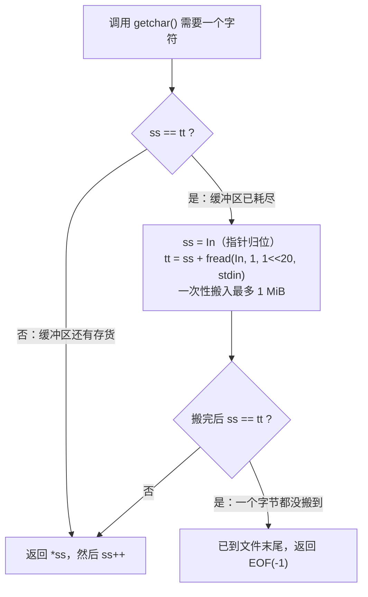

## -1
快读：

```cpp
int read() {
    int x=0,f=1;
    char c=getchar();
    while(c<'0'||c>'9'){if(c=='-') f=-1;c=getchar();}
    while(c>='0'&&c<='9') x=x*10+c-'0',c=getchar();
    return x*f;
}
```


快写：

```cpp
void write(int x) {
     if(x<0) putchar('-'),x=-x;
     if(x>9) write(x/10);
     putchar(x%10+'0');
}
```
# C++ 快读快写（Fast I/O）完整笔记

> **一句话摘要**：快读快写的本质是**绕过格式化解析 + 批量搬运数据以摊还系统调用开销**。本文从最省事的 `ios::sync_with_stdio(false)` 一路讲到 `fread` 自建缓冲区，最后给出可直接落地的工程化模板与逐层原理剖析。

---

## 目录

- [0. 适用范围与前置判断](#s0)
- [1. Level 0：关同步的标准流（能解决 90% 的问题）](#s1)
- [2. Level 1：`getchar` 字符级快读](#s2)
- [3. Level 2：`fread` 整块缓冲（本文核心）](#s3)
- [4. Level 3：输入输出的完全手写缓冲](#s4)
- [5. 性能对照（数量级经验值）](#s5)
- [6. 正确性与边界条件清单](#s6)
- [7. 推荐模板（可直接复制）](#s7)
- [8. 常见错误清单](#s8)
- [9. 原理解释（详细）](#s9)
- [10. 参考来源](#s10)

---

<a id="s0"></a>

## 0. 适用范围与前置判断

### 0.1 什么时候根本不需要快读

| 输入规模                    | 建议                                |
| --------------------------- | ----------------------------------- |
| < 10⁵ 个整数                | 标准 `cin` / `scanf` 即可，无需优化 |
| 10⁵ ~ 10⁶                   | 关同步的 `cin` 或 `scanf` 通常足够  |
| > 10⁶，或时限 < 1s          | 考虑 `getchar` 级快读               |
| > 5×10⁶，或出题人明确卡常数 | 考虑 `fread` 级快读                 |

**判断依据**：读入耗时大致与「总字符数」成正比。一个 `int` 平均 5~6 个字符（含分隔符），读入 10⁶ 个整数约处理 6 MB 字符。

### 0.2 一个必须澄清的误解

> 「读入字符比读入数字快」——**这句话严格来说不成立**。

在操作系统和硬件层面，输入流里根本不存在「数字」这种单位，一切都是字节。`scanf("%d", &x)` 读入的也是字符，只是额外多做了一步**按格式串解析成整数**的工作。真正的收益来自三个地方（详见 [第 9 节](#s9)）：

1. 消除**格式串解析**（`scanf` 每次都要运行时解释 `"%d"`）
2. **批量 refill** 摊还系统调用开销
3. 宏内联 / 手写循环消除**函数调用开销**

---

<a id="s1"></a>

## 1. Level 0：关同步的标准流（能解决 90% 的问题）

### 1.1 代码

```cpp
#include <iostream>
using namespace std;

int main() {
    ios::sync_with_stdio(false);  // 解除 C++ 流与 C stdio 的同步
    cin.tie(nullptr);             // 解除 cin 与 cout 的绑定

    int x;
    while (cin >> x) {
        // ...
    }
    return 0;
}
```

### 1.2 这两行各做了什么

| 语句                          | 作用                                                         |
| ----------------------------- | ------------------------------------------------------------ |
| `ios::sync_with_stdio(false)` | 默认情况下，为保证 `printf` 与 `cout` 混用时输出顺序正确，C++ 流会与 C 的 `stdio` 保持同步，代价是**每次读写都要走一层额外同步逻辑**。关闭后可提速数倍，但**从此不能混用 `cin` 与 `scanf`/`printf`** |
| `cin.tie(nullptr)`            | 默认 `cin` 与 `cout` 绑定，即每次从 `cin` 读入前会先自动 `flush` 一次 `cout`。在「读一批 → 算 → 输出一批」的场景中这完全没必要，解绑可避免大量无谓刷新 |

### 1.3 代价与限制

- 关闭同步后，**同一程序内不得混用** `cin`/`cout` 与 `scanf`/`printf`，输出顺序将不再有保证。
- 该档优化**零风险、零维护成本**，应作为默认选项。只有在它仍不够快时才往下走。

---

<a id="s2"></a>

## 2. Level 1：`getchar` 字符级快读

### 2.1 快读

```cpp
inline int read() {
    int x = 0, f = 1;
    char c = getchar();
    while (c < '0' || c > '9') {      // 跳过所有非数字字符（空白、换行等）
        if (c == '-') f = -1;
        c = getchar();
    }
    while (c >= '0' && c <= '9') {    // 逐位累加
        x = x * 10 + (c - '0');
        c = getchar();
    }
    return x * f;
}
```

### 2.2 逐行解释

| 片段                           | 含义                                                         |
| ------------------------------ | ------------------------------------------------------------ |
| `x = 0, f = 1`                 | `x` 为累加结果，`f` 为符号位（1 表示正，-1 表示负）          |
| `while (c < '0' \|\| c > '9')` | 过滤前导空白。注意这里不区分空格与换行，统一跳过，因此可以自然处理任意排版 |
| `if (c == '-') f = -1`         | 在跳过的过程中若遇到负号则记录符号                           |
| `x = x * 10 + (c - '0')`       | 十进制按位展开：`123 = ((0*10+1)*10+2)*10+3`                 |
| `c - '0'`                      | 利用 ASCII 码中 `'0'`~`'9'` 连续排列的性质，把字符转为数值   |

### 2.3 快写（递归版）

```cpp
inline void write(int x) {
    if (x < 0) putchar('-'), x = -x;
    if (x > 9) write(x / 10);        // 先递归输出高位
    putchar(x % 10 + '0');           // 再输出本位
}
```

**递归深度**：`int` 最多 10 位，`long long` 最多 19 位，栈开销可忽略。

### 2.4 重要修正：不要用 `char` 接返回值

原始写法用 `char c = getchar()`，在 **x86 平台 `char` 默认为 signed** 时侥幸正确。但在 `char` 为 unsigned 的平台（部分 ARM、PowerPC 架构）上，`EOF`（值为 `-1`）会被截断成 `255`，导致 `c < '0' || c > '9'` 恒为真，程序**在文件末尾陷入死循环**。

```cpp
// 正确写法：用 int 接收，避免 EOF 被截断
inline int read() {
    int x = 0, f = 1;
    int c = getchar();               // 注意这里是 int，不是 char
    while (c < '0' || c > '9') {
        if (c == '-') f = -1;
        c = getchar();
    }
    while (c >= '0' && c <= '9') {
        x = x * 10 + (c - '0');
        c = getchar();
    }
    return x * f;
}
```

### 2.5 进阶变体

```cpp
// Linux / OJ 环境下可用免锁版本，进一步省掉加锁开销
// Windows MSVC 下对应的是 getchar_nolock()，不具备可移植性
#ifdef _WIN32
    #define gc() getchar()
#else
    #define gc() getchar_unlocked()
#endif
```

---

<a id="s3"></a>

## 3. Level 2：`fread` 整块缓冲（本文核心）

### 3.1 核心宏

```cpp
char In[1 << 20], *ss = In, *tt = In;
#define getchar() (ss == tt && (tt = (ss = In) + fread(In, 1, 1 << 20, stdin), ss == tt) ? EOF : *ss++)
```

### 3.2 三个变量的含义

| 变量   | 类型            | 含义                                            |
| ------ | --------------- | ----------------------------------------------- |
| `In[]` | `char[1 << 20]` | 用户态缓冲区，容量 1 MiB（`1 << 20` = 1048576） |
| `ss`   | `char*`         | **当前读位置**指针，指向下一个待读取的字符      |
| `tt`   | `char*`         | **缓冲区末尾**指针，指向「有效数据的下一位」    |

### 3.3 宏的执行流程



### 3.4 展开成普通代码（便于理解）

```cpp
inline int fast_getchar() {
    if (ss != tt) {
        return *ss++;                        // 情况一：缓冲区未读完，直接取
    }
    // 情况二：缓冲区已读完，重新批量填充
    ss = In;
    tt = ss + fread(In, 1, 1 << 20, stdin);  // fread 返回实际读到的字节数
    if (ss == tt) {
        return EOF;                          // 情况 2a：读到 0 字节，已到文件末尾
    }
    return *ss++;                             // 情况 2b：正常返回并后移
}
```

宏版本与上面完全等价，只是利用 `&&` 的**短路求值**把 `if` 压成一行：只有当 `ss == tt` 成立时，才会执行逗号表达式中的 `fread` 填充动作。

### 3.5 使用注意事项（务必逐条确认）

1. **不能与其他输入方式混用**。`fread` 直接从 `stdin` 这个 `FILE*` 里搬走了一大块数据，`scanf` / `cin` / 系统 `getchar` 之后再读，只能看到被搬走之后的剩余部分，**前面的数据已经永久丢失**。
2. **缓冲区大小要算内存**。`1 << 20` = 1 MiB。若题目内存限制为 64 MiB 且还有其他大数组，可下调为 `1 << 16`（64 KiB）。
3. **控制台调试需要手动发送 EOF**。在终端输入完所有数据后，Windows 按 `Ctrl + Z` 再回车，Linux / macOS 按 `Ctrl + D`。
4. **宏定义必须在 `#include <cstdio>` 之后**，否则会污染头文件内部的 `getchar` 声明。
5. **考场上写不对不如不写**。没有哪个正常出题人会卡到必须用 `fread` 才能过；写错导致的 WA / TLE 远比慢一点更致命。
6. 该技巧一般配合**文件读写**使用，交互式题目（需要边读边响应）**不适用**。

### 3.6 为什么它比 `getchar` 快

- `getchar()` 即便内部已有 stdio 缓冲，**每读一个字符仍是一次函数调用**（并可能带锁）。
- 宏版本把函数调用**内联展开**为几次指针比较与解引用，且 refill 从「每次一个字节」变成「每 1 MiB 一次系统调用」。
- 二者的差距通常在 **1.5 ~ 3 倍**，量级上属于常数优化，不是算法级改进。

---

<a id="s4"></a>

## 4. Level 3：输入输出的完全手写缓冲

`getchar` 被宏替换后，`putchar` 仍是逐字符调用。若输出量同样巨大，输出侧也要批量化。

### 4.1 输出缓冲区

```cpp
namespace FastIO {
    const int S = 1 << 20;
    char obuf[S];
    int opos = 0;

    inline void pc(char c) {
        if (opos == S) {                    // 缓冲区满，一次性吐出
            fwrite(obuf, 1, opos, stdout);
            opos = 0;
        }
        obuf[opos++] = c;
    }

    inline void flush() {                   // 程序结束前必须调用
        fwrite(obuf, 1, opos, stdout);
        opos = 0;
    }
}
```

### 4.2 非递归快写（推荐）

递归版简单但每次都在压栈，非递归版用栈上数组更直接：

```cpp
template <typename T>
inline void write(T x) {
    if (x < 0) { pc('-'); x = -x; }
    char s[24];                             // long long 最长 19 位，24 足够
    int n = 0;
    do {
        s[n++] = char('0' + x % 10);        // 逆序存入
        x /= 10;
    } while (x);
    while (n--) pc(s[n]);                   // 逆序输出
}
```

**为什么用 `do...while` 而不是 `while`**：`x == 0` 时 `while (x)` 会直接跳出，导致一个字符都不输出。用 `do...while` 可保证至少产生一个 `'0'`。

### 4.3 更激进的方案（了解即可）

| 方案                       | 说明                                                         | 适用场景                      |
| -------------------------- | ------------------------------------------------------------ | ----------------------------- |
| `read()` 系统调用          | 绕过 stdio，直接读文件描述符，比 `fread` 少一层              | Linux 环境，追求极致          |
| `mmap`                     | 把整个文件映射到进程地址空间，之后纯指针扫描，零拷贝         | 输入文件极大（数十 MB）且只读 |
| `std::from_chars`（C++17） | 标准库提供的无 locale、无异常、无分配的字符串转数值，是目前最快的标准方案 | 需要可移植的现代写法          |

```cpp
// C++17 from_chars 示例（需配合整块读入）
#include <charconv>
int x;
auto [ptr, ec] = std::from_chars(pos, end, x);  // pos/end 为缓冲区内的字符区间
```

---

<a id="s5"></a>

## 5. 性能对照（数量级经验值）

> 以下为**经验性的相对量级**，用于建立直觉，非严格基准测试。实际数值受评测机 CPU、编译器优化等级、数据类型、缓存命中率影响，可能偏差较大。

| 方式                            | 相对耗时（越小越好） | 说明                                      |
| ------------------------------- | -------------------- | ----------------------------------------- |
| `cin` / `cout`（默认开同步）    | ~10×                 | 最慢，且 `cin.tie` 默认绑定导致频繁 flush |
| `scanf` / `printf`              | ~3~4×                | 需要运行时解析格式串                      |
| `cin` / `cout`（关同步 + 解绑） | ~2~3×                | 常常已经足够，首选方案                    |
| `getchar` 级快读                | ~1.5×                | 消除格式串解析                            |
| `fread` 级快读                  | 1×                   | 本文基准线                                |
| `fread` + 手写输出缓冲          | < 1×                 | 输入输出双向优化                          |

**结论**：从「默认 `cin`」到「`fread` 级」总共约一个数量级的提升。真正的算法优化（如把 O(n²) 降到 O(n log n)）收益远大于此，**不要本末倒置**。

---

<a id="s6"></a>

## 6. 正确性与边界条件清单

| 边界情况                  | 风险                                      | 处理                                                      |
| ------------------------- | ----------------------------------------- | --------------------------------------------------------- |
| `INT_MIN = -2147483648`   | `x = -x` 在 `int` 上溢出（UB）            | 用 `long long` 接收，或写成 `x = -(long long)x`           |
| 读到 EOF                  | 死循环                                    | 用 `int` 接收 `getchar()` 返回值，显式判断 `EOF`          |
| `x == 0`                  | 快写输出空串                              | 输出侧用 `do...while`                                     |
| `char` 为 unsigned 的平台 | `EOF` 被截断为 255                        | 同上，用 `int` 接收                                       |
| 输入含浮点数              | 整数版快读会把 `.` 当分隔符，读成两个整数 | 需单独写浮点快读（先读整数部分，遇 `.` 后按位权累加小数） |
| 缓冲区耗尽但输入未结束    | 正常，`fread` 会继续搬下一块              | 无需处理，宏逻辑已覆盖                                    |
| 内存限制严格              | 1 MiB 缓冲可能 MLE                        | 调小至 `1 << 16` 或 `1 << 12`                             |

### 6.1 浮点快读（补充）

```cpp
inline double read_double() {
    int c = getchar();
    while (c != '-' && (c < '0' || c > '9')) c = getchar();
    int f = 1;
    if (c == '-') { f = -1; c = getchar(); }
    double x = 0;
    while (c >= '0' && c <= '9') { x = x * 10 + (c - '0'); c = getchar(); }
    if (c == '.') {
        double base = 0.1;
        c = getchar();
        while (c >= '0' && c <= '9') {
            x += (c - '0') * base;
            base *= 0.1;
            c = getchar();
        }
    }
    return x * f;
}
```

> 注：浮点按位权累乘会引入舍入误差累积。若精度要求高，建议读入字符串后用 `std::strtod` 或 `std::from_chars`。

---

<a id="s7"></a>

## 7. 推荐模板（可直接复制）

下面是综合上述所有考点的**工程化最终版本**，输入输出双向缓冲，模板化支持任意整型，处理了 `EOF` 与 `0` 的边界。

```cpp
#include <cstdio>
#include <cstdint>

namespace FastIO {
    const int S = 1 << 20;              // 1 MiB，内存紧张时可改为 1 << 16

    char ibuf[S], *p1 = ibuf, *p2 = ibuf;
    char obuf[S];
    int  opos = 0;

    // ---- 输入 ----
    inline int gc() {                   // 返回 int，避免 EOF(-1) 被 char 截断
        if (p1 == p2) {
            p2 = (p1 = ibuf) + fread(ibuf, 1, S, stdin);
            if (p1 == p2) return EOF;
        }
        return *p1++;
    }

    template <typename T>
    inline T read() {
        T x = 0;
        int f = 1, c = gc();
        while (c < '0' || c > '9') {
            if (c == EOF) return 0;     // 防御：已到末尾
            if (c == '-') f = -1;
            c = gc();
        }
        while (c >= '0' && c <= '9') {
            x = x * 10 + (c - '0');
            c = gc();
        }
        return static_cast<T>(x * f);
    }

    // ---- 输出 ----
    inline void pc(char c) {
        if (opos == S) { fwrite(obuf, 1, opos, stdout); opos = 0; }
        obuf[opos++] = c;
    }

    template <typename T>
    inline void write(T x) {
        if (x < 0) { pc('-'); x = -x; }
        char s[24];
        int n = 0;
        do { s[n++] = char('0' + x % 10); x /= 10; } while (x);
        while (n--) pc(s[n]);
    }

    inline void writeln() { pc('\n'); }

    inline void flush() { fwrite(obuf, 1, opos, stdout); opos = 0; }
}

using namespace FastIO;

int main() {
    // 文件读写时取消注释
    // freopen("test.in", "r", stdin);
    // freopen("test.out", "w", stdout);

    long long a = read<long long>();
    long long b = read<long long>();
    write(a + b);
    writeln();

    flush();                            // 必须调用，否则缓冲区内容可能丢失
    return 0;
}
```

**配套宏（可选）**

```cpp
using ll = long long;
using ull = unsigned long long;
#define Rep(i, s, t) for (int i = (s); i <= (t); ++i)
#define Repd(i, t, s) for (int i = (t); i >= (s); --i)

template <typename T> inline T Max(const T& a, const T& b) { return a > b ? a : b; }
template <typename T> inline T Min(const T& a, const T& b) { return a < b ? a : b; }
template <typename T> inline void Swap(T& a, T& b) { T t = a; a = b; b = t; }
```

---

<a id="s8"></a>

## 8. 常见错误清单

| #    | 错误                                                 | 后果                                             |
| ---- | ---------------------------------------------------- | ------------------------------------------------ |
| 1    | 用了 `fread` 快读，又在别处写 `scanf`                | 数据被吞掉一部分，结果错误且极难调试             |
| 2    | 宏 `#define getchar()` 写在 `#include <cstdio>` 之前 | 编译错误或头文件内部行为异常                     |
| 3    | 用 `char` 接收 `getchar()` 返回值                    | 在 `char` 为 unsigned 的平台上 EOF 失效，死循环  |
| 4    | 输出缓冲忘记 `flush()`                               | 程序退出时最后一批输出丢失，表现为"答案少了几行" |
| 5    | `write` 用 `while (x)` 而非 `do...while`             | 输出 `0` 时什么都不打印                          |
| 6    | 对 `INT_MIN` 取负                                    | 有符号整数溢出，未定义行为                       |
| 7    | 在交互式题目中使用整块缓冲                           | 输入被提前吞掉，程序永远等不到后续输入           |
| 8    | 缓冲区设为 `1 << 20` 但内存限制 16 MiB               | 直接 MLE                                         |

---

<a id="s9"></a>

## 9. 原理解释（详细）

### 9.1 数据从文件到变量，一共经过几层

```
 磁盘 / 键盘
     │
     ▼
 ┌─────────────────────────┐
 │  ① 内核缓冲区            │  ← 由 OS 管理，read() 系统调用从这里拷出
 │    (kernel buffer)      │
 └─────────────────────────┘
     │  read(0, buf, n)  ← 系统调用，用户态↔内核态切换
     ▼
 ┌─────────────────────────┐
 │  ② C 标准库 stdio 缓冲   │  ← FILE* 内部，glibc 默认 4 KiB / 8 KiB
 │    (FILE* stdin)        │
 └─────────────────────────┘
     │  scanf / getchar / fread
     ▼
 ┌─────────────────────────┐
 │  ③ 用户自建缓冲（可选）   │  ← 本文的 In[1<<20]，由宏直接索引
 │    (In[], ss, tt)       │
 └─────────────────────────┘
     │  指针解引用 *ss++
     ▼
   你的变量 x
```

关键点：**每跨一层都有成本**，快读做的就是「尽量少跨层、跨层时一次多搬点」。

### 9.2 三个开销来源，逐一拆解

#### 开销一：系统调用（最贵）

一次 `read()` 系统调用需要：

1. 保存用户态寄存器现场
2. 切换到内核态（特权级提升）
3. 内核执行权限检查、查页表、从设备/页缓存拷贝数据
4. 切回用户态，恢复现场

这个过程是**微秒级**的。如果每读 1 个字符就发起一次系统调用，读入 6 MB 数据意味着 600 万次切换——即使每次只有 1 微秒，也是 6 秒。

**stdio 的价值**：`FILE*` 内部那 4~8 KiB 缓冲，把 600 万次系统调用压缩成约 1500 次。这就是「缓冲」这个思想的核心——**用一次大开销换掉许多次小开销**，即摊还（amortization）。

#### 开销二：格式串解析

`scanf("%d", &x)` 每次调用都要：

1. 逐字符扫描格式串 `"%d"`，识别 `%` 与转换说明符
2. 按说明符分派到对应的解析函数
3. 处理宽度、修饰符、`*` 抑制赋值等可选语法
4. 解析输入字符，做溢出检查，写入目标地址

前 3 步是**每次调用都重复的纯浪费**——格式串在编译期就已知，却在运行时被反复解释。手写快读把这部分完全消除：代码里直接就是 `x = x * 10 + (c - '0')`。

#### 开销三：函数调用与锁

即便 `getchar()` 内部只是从 stdio 缓冲取一个字节，它仍然是：

- 一次函数调用（压栈、跳转、返回）
- 在多线程安全的实现中，还涉及**对 `FILE` 结构加锁 / 解锁**

宏替换版本把这一切展开成几条机器指令：

```cpp
// 展开后大致等价于（伪代码）
if (ss != tt) {
    result = *ss; ss += 1;
} else {
    /* refill */;
}
```

现代编译器开启 `-O2` 后，函数版本大概率也会被内联，所以这部分收益在 O2 下会缩小；但**格式串解析的开销是 `scanf` 独有的，无论怎么优化都消不掉**。

### 9.3 各级方案分别砍掉了什么

| 方案              | 消除格式串解析             | 减少系统调用       | 消除函数调用/锁   |
| ----------------- | -------------------------- | ------------------ | ----------------- |
| `cin`（默认）     | ✗（还多一层 locale/facet） | ✓（自带缓冲）      | ✗                 |
| `scanf`           | ✗                          | ✓                  | ✗                 |
| `cin`（关同步）   | ✗（仍有 locale 开销）      | ✓                  | ✓（部分）         |
| `getchar` 快读    | ✓                          | ✓（靠 stdio 缓冲） | ✗（仍逐字符调用） |
| `fread` 宏替换    | ✓                          | ✓✓（1 MiB 级批量） | ✓（内联展开）     |
| `read()` / `mmap` | ✓                          | ✓✓✓                | ✓                 |

### 9.4 宏替换的逐符号解剖

```cpp
#define getchar() (ss == tt && (tt = (ss = In) + fread(In, 1, 1 << 20, stdin), ss == tt) ? EOF : *ss++)
```

拆开来看：

| 片段                           | 作用                                                         |
| ------------------------------ | ------------------------------------------------------------ |
| `ss == tt &&`                  | 短路求值：若缓冲区还有存货（`ss != tt`），整个条件为假，直接跳到 `: *ss++`，**不触发 refill** |
| `ss = In`                      | 把读指针重置回缓冲区开头（赋值表达式的值是 `In`）            |
| `fread(In, 1, 1 << 20, stdin)` | 从 `stdin` 读最多 1 MiB 到 `In`，**返回实际读到的字节数**    |
| `tt = (ss = In) + fread(...)`  | 末尾指针 = 起始位置 + 实际字节数。一次表达式同时完成「重置 `ss`」和「设置 `tt`」两件事 |
| `, ss == tt`                   | 逗号运算符：先完成上面的赋值，再检查「本次是否读到了 0 字节」 |
| `? EOF : *ss++`                | 读到 0 字节说明已到文件末尾，返回 `EOF`（-1）；否则返回当前字符并**后移指针** |

**为什么 `fread` 必须放在逗号表达式里**：如果写成 `if (ss == tt) { fread(...); tt = ...; }` 就需要花括号，而宏的核心诉求是**作为一个表达式出现在任意位置**（比如 `while ((c = getchar()) < '0')`）。逗号运算符让它保持表达式形态。

### 9.5 为什么绝对不能和其他读入方式混用

`stdin` 是一个 `FILE*`，内部只有一个读位置。

```
初始：stdio 缓冲区内容 = [ABCDEFGHIJKLMNOP...]

执行 fread(In, 1, 1<<20, stdin) 之后：
  In[]        = [ABCDEFGHIJKLMNOP...]     ← 数据被搬到了用户缓冲
  stdio 缓冲  = [已经被掏空，读位置前进了 1 MiB]

此时若调用 scanf("%d", &x)：
  它从 stdio 缓冲的当前读位置开始找数字
  → 前 1 MiB 的输入永久不可见 → 读到的是错误位置的数据
```

这就是为什么「用了这个快读，就不能再用 `getchar()` / `scanf()` / `cin`」——**不是风格问题，是数据会被吃掉**。

反向情况同理：先用 `scanf` 读了一部分，再用 `fread`，那么 `fread` 会从 `scanf` 之后的位置继续搬，前面 `scanf` 读过的不会重复，但顺序必须严格一致，实践中极易出错，因此一律禁止混用。

### 9.6 输出侧原理

`putchar(c)` 与 `getchar()` 对称，也是逐字符调用 stdio。手写输出缓冲的做法：

```cpp
obuf[opos++] = c;                              // 只是写内存，成本约 1 ns
if (opos == S) fwrite(obuf, 1, opos, stdout);  // 攒够 1 MiB 才真正落盘一次
```

把 N 次 `putchar` 压缩成 N/S 次 `fwrite`，与输入侧完全同源。

**递归 `write` 的栈分析**：

```cpp
void write(int x) {
    if (x > 9) write(x / 10);   // 每次除以 10，数字位数减 1
    putchar(x % 10 + '0');
}
```

递归深度 = 十进制位数，`int` ≤ 10，`long long` ≤ 19，每层只有几个字节的栈帧，总计不到 200 字节，**不构成风险**。但非递归版（见 4.2）省掉了函数调用，更快也更直观。

### 9.7 复杂度分析

设输入总字符数为 $N$（含数字、符号、分隔符）。

| 维度         | 结论                                                         |
| ------------ | ------------------------------------------------------------ |
| 时间复杂度   | $\Theta(N)$ —— 每个字符恰好被扫描常数次（跳过阶段 + 累加阶段），无回溯 |
| 空间复杂度   | $\Theta(S)$ —— $S$ 为缓冲区大小，与输入规模无关              |
| 系统调用次数 | $\lceil N / S \rceil$ 次 `fread`，相比无缓冲的 $N$ 次降低 $S$ 倍 |

注意：这里的 $N$ 是**字符数**而非整数个数。读入 $10^6$ 个 `int`，$N \approx 6 \times 10^6$。

### 9.8 澄清「字符比数字快」这个说法

原笔记中「通过读入字符而后来转成数字，而原理就是读入字符比数字快」这句流传很广，但**表述不严谨**。

**事实层面**：

- 在文件系统、管道、终端三个层面，传输单位都是**字节**。不存在「直接读数字」这种操作。
- `scanf("%d", &x)` 底层同样是逐字节读入，再转换成整数。
- 所以「读字符」和「读数字」走的是同一条 I/O 通路，**速度差异不在 I/O，而在解析**。

**准确的表述应该是**：

> 手写快读之所以快，是因为它用**编译期确定的固定逻辑**（`x = x*10 + c - '0'`）替代了 `scanf` 的**运行时格式串解释**，同时通过**大块缓冲**把系统调用次数降低 $S$ 倍。

理解这一点很重要——它能帮你判断什么时候快读有用（格式固定、数据量极大），什么时候没用（数据本来就小，或者瓶颈在算法而非 I/O）。

### 9.9 什么时候不该用

1. **算法复杂度没优化到位时**。先确认你的 $O(n^2)$ 不会因为快读变成 AC——不会。
2. **交互式题目**。整块缓冲会把后续输入提前吞掉，程序永远等不到交互响应。
3. **需要读字符串 / 浮点混合格式**时。手写解析要处理的情况变多，出错概率陡增。
4. **内存限制 < 16 MiB**。1 MiB 缓冲占比过高。
5. **考场上不确定能不能写对**。收益是常数级，风险是整题 WA，性价比不划算。

---

<a id="s10"></a>

## 10. 参考来源

- 原始笔记整理自 CSDN：[快读快写模板](https://blog.csdn.net/qq_41996523/article/details/99539179)（fjzg）
- `std::from_chars` 参考：[cppreference - std::from_chars](https://en.cppreference.com/w/cpp/utility/from_chars)
- 标准流同步机制：[cppreference - std::ios_base::sync_with_stdio](https://en.cppreference.com/w/cpp/io/ios_base/sync_with_stdio)

---

*整理于 2026-10。原始笔记记录于 2022-05-31。*

