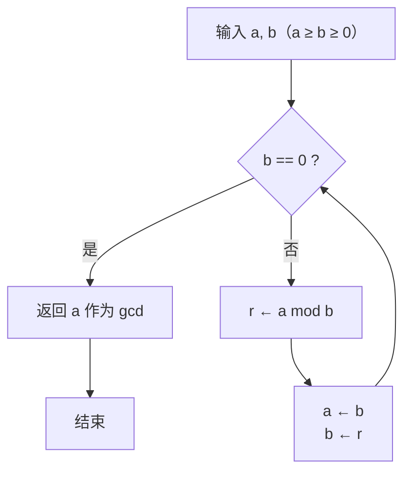

# 欧几里得算法：从手算到证明、复杂度与扩展

> **一句话概括**：欧几里得算法（Euclidean Algorithm，又称「辗转相除法」）用一个等式
> $\gcd(a,\ b) = \gcd(b,\ a \bmod b)$
> 反复把「求大数对的公约数」缩小为「求小数对的公约数」，直到余数为零。
> 它是现存最古老的算法之一，出自《几何原本》第七卷命题 1、2，至今仍是所有计算机代数系统的地基。

本文档使用 **GitHub Flavored Markdown** 编写，其中的数学公式（`$...$` / `$$...$$`）与 `mermaid` 流程图均可在 GitHub 上直接渲染，无需任何插件。

---

## 阅读路线

| 层级 | 章节      | 目标                                                |
| :--- | :-------- | :-------------------------------------------------- |
| 入门 | 第 1–2 节 | 会手算，理解「为什么这样做就是在求最大公约数」      |
| 核心 | 第 3–4 节 | 掌握正确性证明的四个环节，能写出递归 / 迭代两种实现 |
| 深入 | 第 5–6 节 | 明白复杂度为什么是对数级，掌握扩展欧几里得与模逆元  |
| 拓展 | 第 7–9 节 | Stein 算法、连分数、更相减损术、工程陷阱与应用场景  |
| 检验 | 第 10 节  | 自测题（附答案与提示）                              |

> GitHub 在 Markdown 文件视图右上角自带 **Outline（大纲）** 按钮，可直接跳转各节标题，无需手写目录链接。

---

## 1. 先从一个完整的例子出发

**问题**：求 $1997$ 和 $615$ 的最大公约数。

按「大数 ÷ 小数，取余数；再用上一步的除数 ÷ 余数」反复进行：

| 步骤 | 带余除法算式                | 商 $q$ | 余数 $r$ | 新的待求问题      |
| :--: | :-------------------------- | :----: | :------: | :---------------- |
|  1   | $1997 = 3 \times 615 + 152$ |   3    |   152    | $\gcd(615,\ 152)$ |
|  2   | $615 = 4 \times 152 + 7$    |   4    |    7     | $\gcd(152,\ 7)$   |
|  3   | $152 = 21 \times 7 + 5$     |   21   |    5     | $\gcd(7,\ 5)$     |
|  4   | $7 = 1 \times 5 + 2$        |   1    |    2     | $\gcd(5,\ 2)$     |
|  5   | $5 = 2 \times 2 + 1$        |   2    |    1     | $\gcd(2,\ 1)$     |
|  6   | $2 = 2 \times 1 + 0$        |   2    |  **0**   | 停止              |

**结论**：最后一步余数为 $0$，此时的**除数 $1$** 就是答案，即

$$\gcd(1997,\ 615) = 1$$

也就是说 $1997$ 与 $615$ **互质**（coprime）。

写成紧凑的链式形式（这也是最常见的书写方式）：

```
1997 = 3 × 615 + 152
 615 = 4 × 152 +   7
 152 = 21 ×   7 +  5
   7 =  1 ×   5 +  2
   5 =  2 ×   2 +  1
   2 =  2 ×   1 +  0   ← 余数为 0，除数 1 即为 gcd
```

> **为什么这里恰好得到 1？** $1997$ 是一个质数，而 $615 = 3 \times 5 \times 41$，两者没有公共质因子，因此最大公约数为 $1$。
> 注意：算法的输出只告诉你「公约数是多少」，并不直接给出质因数分解——这恰恰是它能高效的原因。

---

## 2. 算法的三种等价表述

同一个算法，可以从三个角度描述。理解这三种视角，后面进阶内容会轻松很多。

### 2.1 除法表述（最常用）

反复执行 $\gcd(a,\ b) \to \gcd(b,\ a \bmod b)$，直到 $b = 0$。

### 2.2 减法表述（最朴素）

$$\gcd(a,\ b) = \gcd(a - b,\ b) \quad (a > b)$$

即「以少减多，更相减损」。《九章算术》中的「更相减损术」正是这一形式（详见第 7.3 节）。

> 除法表述是减法表述的**批量优化**：一次除法相当于连续减去商那么多次。
> 例如 $1997 - 615$ 要减 3 次才小于 615，而 $1997 \bmod 615$ 一步到位。
> 这就是为什么减法版最坏会退化到 $O(a/b)$ 级别，而除法版始终是对数级。

### 2.3 几何表述（最直观）

把问题看成：**用一个矩形（边长 $a \times b$）不断切出最大的正方形，最后剩下的那个能整除全部的正方形边长，就是 $\gcd(a,\ b)$。**

以 $\gcd(48,\ 18) = 6$ 为例：

```
初始：48 × 18 的矩形
┌───────────┬───────────┬────────┐
│           │           │        │
│  18 × 18  │  18 × 18  │ 12 × 18│    ← 切出 2 个 18×18（商=2）
│           │           │        │
└───────────┴───────────┴────────┘
                             ↓ 余下 12 × 18

┌────────┬──────┐
│        │      │
│ 12×12  │ 12×6 │                    ← 切出 1 个 12×12（商=1）
│        │      │
└────────┴──────┘
              ↓ 余下 12 × 6

┌─────┬─────┐
│ 6×6 │ 6×6 │                        ← 切出 2 个 6×6（商=2），恰好铺满
└─────┴─────┘
              ↓ 没有剩余 ⇒ gcd(48, 18) = 6
```

这三步的商 $(2,\ 1,\ 2)$ 与除法表述完全一致：

$$48 = 2 \times 18 + 12,\quad 18 = 1 \times 12 + 6,\quad 12 = 2 \times 6 + 0$$

---

## 3. 为什么它是对的：完整证明

这一节是整个笔记的核心。证明拆成四个环节：**引理 → 不变式 → 终止性 → 正确性**。

### 3.1 关键引理

> **引理**：对任意整数 $a$ 和正整数 $b$，设 $a = qb + r$（$0 \le r < b$），则
> $$\gcd(a,\ b) = \gcd(b,\ r)$$

**证明**（用「互相整除」证明两个公约数集合相等）：

设 $d$ 是 $a$ 与 $b$ 的任一公约数，即 $d \mid a$ 且 $d \mid b$。
由 $r = a - qb$，而 $d$ 整除 $a$ 与 $qb$（$d \mid b \Rightarrow d \mid qb$），故 $d \mid (a - qb)$，即 $d \mid r$。
于是 $d$ 也是 $b$ 与 $r$ 的公约数 $\Rightarrow$ $\gcd(a,\ b)$ 这个「最大的 $d$」满足 $\gcd(a,\ b) \le \gcd(b,\ r)$。

反过来，设 $e \mid b$ 且 $e \mid r$。由 $a = qb + r$，$e$ 整除 $qb$ 与 $r$，故 $e \mid a$。
于是 $e$ 也是 $a$ 与 $b$ 的公约数 $\Rightarrow$ $\gcd(b,\ r) \le \gcd(a,\ b)$。

两边夹逼，得 $\gcd(a,\ b) = \gcd(b,\ r)$。$\blacksquare$

> **一句话记忆**：$a$ 与 $b$ 的公约数集合，和 $b$ 与 $r$ 的公约数集合**完全相同**（不只是最大值相同）。这是后面所有推导的支点。

### 3.2 循环不变式

定义余数序列：

$$r_0 = a,\quad r_1 = b,\quad r_{i-1} = q_i \cdot r_i + r_{i+1} \quad (0 \le r_{i+1} < r_i)$$

则对每一步 $i$，不变式为：

$$\gcd(r_0,\ r_1) = \gcd(r_i,\ r_{i+1})$$

由引理，每做一次带余除法，$\gcd$ 的值保持不变。这就是「辗转」却不改变答案的原因。

### 3.3 终止性

余数序列满足严格递减的非负整数链：

$$b = r_1 > r_2 > r_3 > \cdots \ge 0$$

严格递减的非负整数序列必然有限，因此一定存在某个 $k$ 使 $r_{k+1} = 0$，算法终止。

### 3.4 结果的正确性

终止时 $r_{k+1} = 0$，此时由不变式：

$$\gcd(a,\ b) = \gcd(r_k,\ 0) = r_k$$

而 $\gcd(x,\ 0) = x$（因为任何 $x$ 的因数都是 $x$ 与 $0$ 的公约数，最大者即 $|x|$）。

所以**最后一步的除数 $r_k$ 就是 $\gcd(a,\ b)$**——这就是「余数为 0 时取当前算式的除数」的依据。

### 3.5 算法流程



---

## 4. 代码实现

### 4.1 递归版（最短，但可读性依赖习惯）

```cpp
// C++：递归版，要求 a, b 非负
long long gcd(long long a, long long b) {
    return b == 0 ? a : gcd(b, a % b);
}
```

```python
# Python：递归版
def gcd(a: int, b: int) -> int:
    return a if b == 0 else gcd(b, a % b)
```

### 4.2 迭代版（工程首选）

```cpp
#include <cstdlib>   // std::abs（注意 <cstdlib> 提供整型重载）

// 迭代版：自动处理负输入，返回非负结果
long long gcd(long long a, long long b) {
    a = std::abs(a);
    b = std::abs(b);
    while (b != 0) {
        long long r = a % b;   // C++11 起，负数取模结果符号与被除数一致
        a = b;
        b = r;
    }
    return a;                  // b == 0 时 a 即为 gcd；gcd(0,0) 返回 0
}
```

```python
def gcd(a: int, b: int) -> int:
    a, b = abs(a), abs(b)
    while b:
        a, b = b, a % b        # Python 的 % 结果始终与除数同号（非负）
    return a
```

> **C++17 之后直接用标准库**：`#include <numeric>` → `std::gcd(a, b)` / `std::lcm(a, b)`。
> `std::gcd` 的行为已定义为返回**非负**结果，且 $\gcd(0,\ 0) = 0$，无需自己处理符号。
> Python 3.5+ 用 `math.gcd`（3.9 起支持任意多个参数，如 `math.gcd(12, 18, 24)`）。

### 4.3 递归深度安全吗？

安全。由第 5 节的复杂度分析，递归深度为 $O(\log \min(a,\ b))$。即便对 `long long` 范围内的最大值（$\approx 9.2 \times 10^{18}$，19 位十进制），最大深度也不超过约 90 层，远不会爆栈。

### 4.4 常见错误写法

```cpp
// ✗ 错误：用减法实现，遇到 (10^18, 1) 会循环 10^18 次
while (a != b) { if (a > b) a -= b; else b -= a; }

// ✗ 错误：先乘后除，a*b 极易溢出
long long lcm = a * b / gcd(a, b);

// ✓ 正确：先除后乘
long long lcm = a / gcd(a, b) * b;
```

---

## 5. 复杂度分析

### 5.1 除法的次数（Lamé 定理）

直觉上余数每次至少减半吗？**不是**——比如 $(13,\ 8)$：$13 \bmod 8 = 5$，只从 8 降到 5，不到一半。但**每两步**至少减半：

> **两步减半性质**：$r_{i+2} < \dfrac{r_i}{2}$
>
> 证明：若 $r_{i+1} \le r_i / 2$，则 $r_{i+2} < r_{i+1} \le r_i/2$，成立。
> 若 $r_{i+1} > r_i / 2$，则 $r_i = q \cdot r_{i+1} + r_{i+2}$ 中的商只能是 $q = 1$
> （因为 $2r_{i+1} > r_i$），于是 $r_{i+2} = r_i - r_{i+1} < r_i / 2$。$\blacksquare$

由此直接得到除法次数 $n = O(\log \min(a,\ b))$，但常数较粗。更精确的结果由 **Lamé 定理**（1844）给出：

> **Lamé 定理**：若算法对 $(a,\ b)$（$a > b > 0$）执行了 $n$ 次除法，则
> $$b \ge F_{n+1}$$
> 其中 $F_1 = F_2 = 1,\ F_{k} = F_{k-1} + F_{k-2}$ 为斐波那契数列。

由 $F_k \approx \varphi^k / \sqrt{5}$（$\varphi = \frac{1+\sqrt{5}}{2} \approx 1.618$）可反解出：

$$n \;\lesssim\; \log_{\varphi} b + O(1) \;\approx\; 1.44 \log_2 b \;\approx\; 4.8 \log_{10} b$$

**实用推论（Knuth 版）**：若较小的数 $b$ 在十进制下不超过 $k$ 位（即 $b < 10^k$），则除法步数 **$n \le 5k$**。

对 64 位整数（$k = 19$）而言，最坏步数不超过 95 次——这就是它「瞬间完成」的原因。

### 5.2 最坏情况：连续的斐波那契数

Lamé 定理的下界是**紧的**：当输入是相邻的两个斐波那契数时，每一步的商都是 $1$（1 除外），余数下降最慢，步数达到最大。

$$\gcd(F_{k+1},\ F_k) \ \text{需要}\ k-1\ \text{步}$$

例如 $\gcd(6765,\ 4181)$（即 $F_{20},\ F_{19}$）需要 18 步，而这两个数只有 4 位十进制。

```cpp
// 验证：对 64 位整数，最大步数出现在相邻斐波那契数上
// F_92 ≈ 7.54e18 是最后一个不溢出 int64 的斐波那契数
```

### 5.3 位复杂度（深入一层）

上面的 $O(\log b)$ 统计的是**除法次数**，把每次除法当成 $O(1)$。严格按位计算时：

| 实现                                      | 位复杂度（$n$ 为输入位数）  |
| :---------------------------------------- | :-------------------------- |
| 朴素辗转相除                              | $O(n^2)$                    |
| Lehmer's GCD（用高位若干位做商估计）      | $O(n^2)$ 但常数大幅降低     |
| Schönhage–Strassen 快速 GCD（分治 + FFT） | $O(n \log^2 n \log \log n)$ |

对普通编程题和工程场景（$n \le 64$），朴素版完全够用；只有在实现大整数库（如 GMP）时才需要后面两种。

---

## 6. 扩展欧几里得算法（Extended Euclidean Algorithm）

这是欧几里得算法最重要的升级：不只求 $\gcd$，还求出**把它表示成 $a$ 与 $b$ 线性组合的系数**。

### 6.1 Bézout 恒等式

> **定理**：对任意整数 $a,\ b$（不全为 0），存在整数 $x,\ y$ 使得
> $$ax + by = \gcd(a,\ b)$$
> 且 $\gcd(a,\ b)$ 是**能表示为 $ax + by$ 的最小正整数**。

推论（互质的等价刻画）：$\gcd(a,\ b) = 1 \iff \exists x, y \in \mathbb{Z},\ ax + by = 1$。

### 6.2 系数的递推推导

设 $\gcd(b,\ a \bmod b) = b \cdot x' + (a \bmod b) \cdot y'$，且 $a \bmod b = a - \lfloor a/b \rfloor \cdot b$，代入：

$$\begin{aligned}
\gcd(a,\ b) &= b x' + \left(a - \left\lfloor \frac{a}{b} \right\rfloor b\right) y' \\
&= a \cdot y' + b \cdot \left(x' - \left\lfloor \frac{a}{b} \right\rfloor y'\right)
\end{aligned}$$

于是得到递推（记 $q = \lfloor a/b \rfloor$）：

$$x = y', \qquad y = x' - q \cdot y'$$

**边界**：当 $b = 0$ 时，$a \cdot 1 + 0 \cdot 0 = a$，故 $x = 1,\ y = 0$。

### 6.3 手算实例：gcd(1997, 615) 的 Bézout 系数

沿着第 1 节的商序列 $(3,\ 4,\ 21,\ 1,\ 2,\ 2)$ 迭代维护 $r_i = s_i \cdot 1997 + t_i \cdot 615$：

| $i$  | $q$  | $r_i$ |  $s_i$  |  $t_i$   | 校验 $s_i \cdot 1997 + t_i \cdot 615$ |
| :--: | :--: | :---: | :-----: | :------: | :------------------------------------ |
|  0   |  —   | 1997  |    1    |    0     | $1997$                                |
|  1   |  —   |  615  |    0    |    1     | $615$                                 |
|  2   |  3   |  152  |    1    |    −3    | $1997 - 3 \times 615 = 152$           |
|  3   |  4   |   7   |   −4    |    13    | $-7988 + 7995 = 7$                    |
|  4   |  21  |   5   |   85    |   −276   | $169745 - 169740 = 5$                 |
|  5   |  1   |   2   |   −89   |   289    | $-177733 + 177735 = 2$                |
|  6   |  2   | **1** | **263** | **−854** | $525211 - 525210 = 1$                 |
|  7   |  2   |   0   |  −615   |   1997   | $-1228155 + 1228155 = 0$              |

**结果**：

$$263 \times 1997 + (-854) \times 615 = 1$$

即 $x = 263,\ y = -854$。（注意最后两列的 $s_7 = -615,\ t_7 = 1997$ 恰好是一组"平凡"解，这也是循环终止的自然标志。）

**解的范围**：Bézout 解不唯一，但扩展欧几里得算法给出的是**最小解**，满足

$$|x| \le \frac{b}{2g}, \qquad |y| \le \frac{a}{2g}$$

本例中 $|263| \le 615/2 = 307.5$ ✓，$|{-854}| \le 1997/2 = 998.5$ ✓。通解为：

$$x = 263 + 615k,\quad y = -854 - 1997k \quad (k \in \mathbb{Z})$$

### 6.4 代码实现

```cpp
// 返回 gcd(a, b)，并令 x, y 满足 a*x + b*y = gcd(a, b)
long long exgcd(long long a, long long b, long long& x, long long& y) {
    if (b == 0) {
        x = 1;
        y = 0;
        return a;                     // 注意：a 可能为负，需要时在外面取绝对值
    }
    long long x1, y1;
    long long g = exgcd(b, a % b, x1, y1);
    x = y1;
    y = x1 - (a / b) * y1;
    return g;
}
```

```python
def exgcd(a: int, b: int) -> tuple[int, int, int]:
    """返回 (g, x, y)，满足 a*x + b*y = g = gcd(a, b)"""
    if b == 0:
        return (a, 1, 0)
    g, x1, y1 = exgcd(b, a % b)
    return (g, y1, x1 - (a // b) * y1)
```

> ⚠️ **溢出提醒**：`y = x1 - (a/b) * y1` 中的乘法在 $a,\ b$ 很大时可能超出 `long long`。
> 若 $|a|, |b| \le 10^9$，系数上界约 $10^9$，安全；若达到 $10^{18}$ 量级，需要使用 `__int128`。

### 6.5 三大应用

#### (1) 求模逆元（Modular Inverse）

$a$ 在模 $m$ 下的逆元存在的充要条件是 $\gcd(a,\ m) = 1$。由 $ax + my = 1$ 得 $ax \equiv 1 \pmod m$，故

$$a^{-1} \equiv x \pmod m$$

```cpp
// 返回 a 在模 m 下的逆元；若不存在（不互质）返回 -1
long long modInv(long long a, long long m) {
    long long x, y;
    long long g = exgcd(a, m, x, y);
    if (g != 1) return -1;                       // 逆元不存在
    return (x % m + m) % m;                      // 修正负数
}
```

对本例数据：$615^{-1} \bmod 1997 = (-854) \bmod 1997 = 1143$。
验证：$615 \times 1143 = 702945 = 352 \times 1997 + 1$ ✓

#### (2) 解二元一次不定方程 $ax + by = c$

有整数解 $\iff \gcd(a,\ b) \mid c$。令 $k = c / \gcd(a,\ b)$，先解 $ax_0 + by_0 = g$，则特解为 $(kx_0,\ ky_0)$，通解为

$$x = kx_0 + \frac{b}{g} t,\qquad y = ky_0 - \frac{a}{g} t \quad (t \in \mathbb{Z})$$

#### (3) 解线性同余方程 $ax \equiv c \pmod m$

转化为 $ax + my = c$，用 (2) 求解；解在模 $m/g$ 意义下有 $g$ 个不同解。

---

## 7. 变体、推广与历史对照

### 7.1 二进制 GCD（Stein 算法）

除法在硬件上昂贵。Stein 算法只用**减半、减法、判断奇偶**（即移位与位运算），在密码学大整数场景下更快。

```
gcd(a, b):
    if a == 0: return b
    if b == 0: return a
    if a == b: return a
    if a, b 均为偶:  return 2 * gcd(a/2, b/2)
    if a 偶 b 奇:    return gcd(a/2, b)
    if a 奇 b 偶:    return gcd(a, b/2)
    // 此时 a, b 均为奇数，且 a > b
    return gcd((a - b) / 2, b)      // 差为偶数，可直接减半
```

依据的恒等式（$a,\ b$ 为奇数时）：$\gcd(a,\ b) = \gcd(|a - b|,\ \min(a,\ b))$。

```cpp
// Stein 算法，迭代版（要求非负输入）
unsigned long long gcdBinary(unsigned long long a, unsigned long long b) {
    if (a == 0) return b;
    if (b == 0) return a;
    int shift = 0;
    while (((a | b) & 1) == 0) {     // 统计公共的 2 的幂
        a >>= 1; b >>= 1; ++shift;
    }
    while ((a & 1) == 0) a >>= 1;    // 抹去 a 剩余的 2 因子
    do {
        while ((b & 1) == 0) b >>= 1;
        if (a > b) std::swap(a, b);
        b -= a;                       // b 变为偶数，下一轮会被减半
    } while (b != 0);
    return a << shift;
}
```

- 复杂度：$O((\log a)(\log b))$ 次位运算，等价于 $O(n^2)$ 位复杂度，与朴素版同阶但**常数显著更小**。
- 适用场景：大整数库、嵌入式无硬件除法器的环境。
- 不适用：普通 `int` 规模——此时现代 CPU 的硬件除法器往往更快，且代码复杂易错。

### 7.2 与连分数的关系

欧几里得算法每一步的商，正好是 $a/b$ 的**连分数展开**的项：

$$\frac{1997}{615} = 3 + \cfrac{1}{4 + \cfrac{1}{21 + \cfrac{1}{1 + \cfrac{1}{2 + \cfrac{1}{2}}}}} = [3;\ 4,\ 21,\ 1,\ 2,\ 2]$$

反过来，连分数的渐近分数（convergents）给出**最佳有理逼近**，这正是求解 Pell 方程 $x^2 - Dy^2 = 1$ 的工具。

### 7.3 更相减损术（中国古代算法）

《九章算术·方田》：「可半者半之，不可半者，副置分母、子之数，以少减多，更相减损，求其等也。以等数约之。」

| 对比项   | 更相减损术                            | 欧几里得除法版   |
| :------- | :------------------------------------ | :--------------- |
| 核心操作 | 反复相减                              | 取模（批量相减） |
| 额外技巧 | 先提取公共的 2 的幂（「可半者半之」） | 无               |
| 最坏步数 | $O(a)$（如 $\gcd(10^9,\ 1)$）         | $O(\log a)$      |
| 本质     | 与 Stein 算法的「半之」思想同源       | 除法批量化       |

可以说：**更相减损术 ≈ 减法版欧几里得 + 提取 2 的幂**，是 Stein 算法的古代雏形。

### 7.4 在其它代数结构上的推广

欧几里得算法成立的关键是「存在带余除法且余数严格变小」，即**欧几里得整环**（Euclidean Domain）。因此它同样适用于：

| 结构                                    | 「余数大小」的度量         | 可求的对象                           |
| :-------------------------------------- | :------------------------- | :----------------------------------- |
| $\mathbb{Z}$                            | 绝对值                     | 整数的 gcd                           |
| $F[x]$（域上多项式）                    | 多项式次数                 | 多项式的 gcd（用于纠错码、符号计算） |
| $\mathbb{Z}[i]$（高斯整数）             | 范数 $N(a+bi) = a^2 + b^2$ | 高斯整数的 gcd                       |
| $\mathbb{Z}[\omega]$（Eisenstein 整数） | 范数                       | 同上                                 |

例如多项式版用于 BCH / Reed–Solomon 编码的解码，是 CD、二维码、深空通信的数学基础之一。

---

## 8. 工程实践中的坑

|  #   | 陷阱                      | 说明与对策                                                   |
| :--: | :------------------------ | :----------------------------------------------------------- |
|  1   | **负数取模**              | C/C++ 的 `%` 结果符号与被除数一致（$-7 \% 3 = -1$）；Python 的 `%` 与除数同号（$-7 \% 3 = 2$）。算法本身不受影响，但**结果可能是负的 gcd**。对策：入参取绝对值，或出参取绝对值。 |
|  2   | **`std::abs(LLONG_MIN)`** | 溢出未定义行为。若可能取到极值，转无符号处理。               |
|  3   | **$\gcd(0,\ 0)$**         | 数学上无定义，工程上约定为 $0$（`std::gcd` 即如此）。        |
|  4   | **$\gcd(a,\ 0)$**         | 等于 $\lvert a \rvert$。算法天然处理（第一步 `b == 0` 直接返回）。 |
|  5   | **`lcm` 溢出**            | 必写 `a / gcd(a,b) * b`，不可写 `a * b / gcd(a,b)`。         |
|  6   | **`exgcd` 系数溢出**      | $|x| \le b/(2g)$、$|y| \le a/(2g)$，评估量级；$10^{18}$ 级输入需 `__int128`。 |
|  7   | **递归 vs 迭代**          | 递归深度 $O(\log n)$，实际安全；但对性能敏感的热路径，迭代版可省函数调用开销。 |
|  8   | **尾递归优化**            | 递归版是尾递归，但 C++ 标准不保证 TCO，别依赖。              |

---

## 9. 应用场景一览

1. **分数约分**：分子分母同除 $\gcd$，这是「更相减损术」最原始的用途。
2. **模逆元 → RSA**：私钥指数 $d$ 由 $ed \equiv 1 \pmod{\varphi(n)}$ 解出，核心就是扩展欧几里得。
3. **中国剩余定理（CRT）**：合并同余方程组时逐个求逆元。
4. **线性同余 / 不定方程**：如「百钱买百鸡」类问题的通解。
5. **计算几何**：把方向向量 $(\Delta x,\ \Delta y)$ 除以 $\gcd$ 得到最简步进，用于格点计数（Pick 定理、线段上格点数 $=\gcd(|\Delta x|,\ |\Delta y|) + 1$）。
6. **有理数逼近 / 连分数**：Pell 方程、丢番图逼近。
7. **单位化简**：比例、比例尺、采样率的约简。
8. **多项式运算**：纠错码、计算机代数系统。

> **一个有意思的结论**：$\gcd$ 可以在 **$AC^0$** 之外但属于 **NC** 类，整数 gcd 的并行复杂度至今是研究课题；而我们日常用的这个串行版本，已经足够快。

---

## 10. 自测题

<details>
<summary><b>题 1</b>：手算 $\gcd(1071,\ 462)$，写出全部步骤。</summary>


```
1071 = 2 × 462 + 147
 462 = 3 × 147 +  21
 147 = 7 ×  21 +   0   ← 除数 21 即为 gcd
```

答案：$\gcd(1071,\ 462) = 21$。

</details>

<details>
<summary><b>题 2</b>：证明 $\gcd(ka,\ kb) = k \cdot \gcd(a,\ b)$（$k > 0$）。</summary>


设 $g = \gcd(a,\ b)$。一方面 $kg \mid ka$ 且 $kg \mid kb$，故 $kg$ 是公约数 $\Rightarrow \gcd(ka,\ kb) \ge kg$。
另一方面，对 $ka,\ kb$ 执行欧几里得算法：每一步的余数序列恰好是 $a,\ b$ 的余数序列乘 $k$
（因为 $ka = q \cdot kb + kr \iff a = qb + r$），故最终余数为 $0$ 前的除数是 $kg$。
因此 $\gcd(ka,\ kb) = kg$。$\blacksquare$

</details>

<details>
<summary><b>题 3</b>：用扩展欧几里得求 $1997^{-1} \bmod 615$。</summary>


由第 6.3 节得 $263 \times 1997 - 854 \times 615 = 1$，故 $1997 \times 263 \equiv 1 \pmod{615}$。

答案：$1997^{-1} \equiv 263 \pmod{615}$。
验证：$1997 \times 263 = 525211 = 854 \times 615 + 1$ ✓

</details>

<details>
<summary><b>题 4</b>：已知 $\gcd(F_{k+1},\ F_k)$ 需要 $k-1$ 步。请说明为什么这给出了算法的最坏情况。</summary>


由相邻斐波那契数的递推 $F_{k+1} = 1 \cdot F_k + F_{k-1}$，每一步的商都是 $1$，余数下降比例接近 $\varphi^{-1} \approx 0.618$，是所有输入中下降最慢的。
而 Lamé 定理给出 $b \ge F_{n+1}$ 的下界，说明 $n$ 步至少需要 $b$ 达到 $F_{n+1}$ 量级——斐波那契数恰好取到等号，所以这个下界是紧的。

</details>

<details>
<summary><b>题 5</b>：判断下列说法是否正确：$1997$ 与 $615$ 互质，所以 $615$ 在模 $1997$ 下有逆元；逆元是 $263$。</summary>


前半句对，后半句错。$263$ 是 **$1997$ 在模 $615$ 下的逆元**（见题 3）。
$615$ 在模 $1997$ 下的逆元是 **$1143$**（见第 6.5 节）。
$x$ 与 $y$ 的角色不要混淆：$ax + by = 1$ 中，$x$ 是 $a$ 在模 $b$ 下的逆元，$y$ 是 $b$ 在模 $a$ 下的逆元。

</details>

---

## 附：核心结论速查卡

| 项目             | 内容                                                     |
| :--------------- | :------------------------------------------------------- |
| 核心递推         | $\gcd(a,\ b) = \gcd(b,\ a \bmod b)$                      |
| 终止条件         | $b = 0$，返回 $a$                                        |
| 时间（除法次数） | $O(\log \min(a,b))$，最坏 $\le 5 \times$ 十进制位数      |
| 最坏输入         | 相邻斐波那契数 $F_{k+1},\ F_k$                           |
| 位复杂度         | 朴素 $O(n^2)$                                            |
| 扩展形式         | $ax + by = \gcd(a,b)$，系数递推 $x = y',\ y = x' - q y'$ |
| 逆元条件         | $a^{-1} \pmod m$ 存在 $\iff \gcd(a,\ m) = 1$             |
| `lcm` 安全写法   | `a / gcd(a,b) * b`                                       |
| C++ 标准库       | `#include <numeric>` → `std::gcd` / `std::lcm`（C++17）  |
| Python 标准库    | `math.gcd`（3.9+ 支持多参数）                            |

---

## 参考资料

1. Euclid, *Elements*, Book VII, Propositions 1–2.（原始出处）
2. G. Lamé, *Note sur la limite du nombre des divisions dans la recherche du plus grand commun diviseur*, 1844.（Lamé 定理）
3. D. E. Knuth, *The Art of Computer Programming*, Vol. 2, §4.5.2.（复杂度与算法分析）
4. T. H. Cormen et al., *Introduction to Algorithms*, 第 31 章「Number-Theoretic Algorithms」。
5. 《九章算术·方田章》「约分术」——更相减损术。

