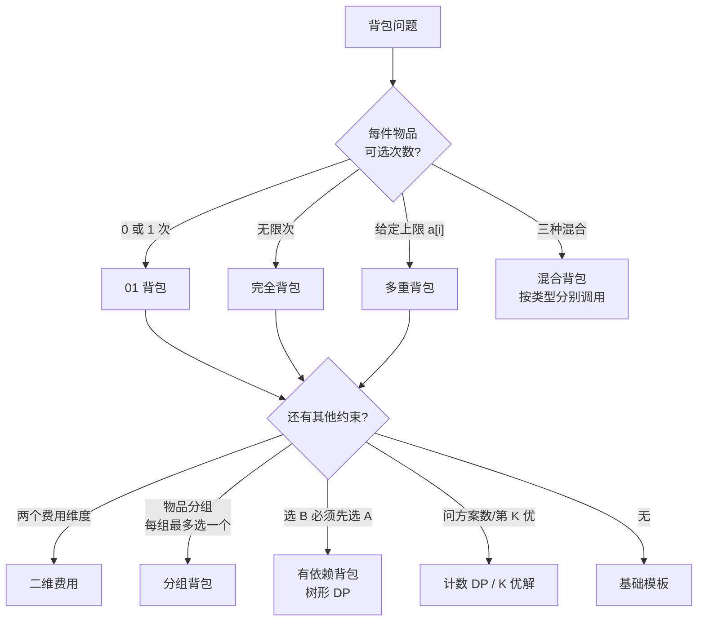

# 背包问题 DP 模板笔记

> 从朴素二维到单调队列优化，覆盖 01 / 完全 / 多重 / 混合 / 二维费用 / 分组 / 依赖 / 计数 / 第 K 优 全部常见模型。
> 所有代码均可直接粘贴使用，已在文中标注前置条件与易错点。

**符号约定**（全文统一）

| 符号                  | 含义                                      |
| --------------------- | ----------------------------------------- |
| `n`                   | 物品种类数                                |
| `V`（原题常记作 `m`） | 背包容量（费用上界）                      |
| `w[i]`                | 第 `i` 件物品的费用（重量 / 体积 / 时间） |
| `v[i]`                | 第 `i` 件物品的价值                       |
| `a[i]`                | 第 `i` 件物品的数量上限（多重背包）       |
| `f[c]`                | 容量为 `c` 时的最优价值（滚动数组）       |

复杂度记号中，`N` 指物品数，`V` 指容量，`Σn` 指所有物品数量之和。

---

## 目录

- [0. 修订说明与阅读建议](#s0)
- [1. 选型速查：一眼确定模型](#s1)
- [2. 通用分析框架（先理解，再背模板）](#s2)
- [3. 01 背包 · 0-1 Knapsack](#s3)
- [4. 完全背包 · Unbounded Knapsack](#s4)
- [5. 多重背包 · Bounded Knapsack](#s5)
- [6. 混合背包](#s6)
- [7. 二维费用背包](#s7)
- [8. 分组背包](#s8)
- [9. 有依赖的背包（主件-附件 / 树形）](#s9)
- [10. 计数类：方案数与最优方案数](#s10)
- [11. 进阶变形](#s11)
- [12. 整合模板：一份可编译的 C++ 代码](#s12)
- [13. 常见错误清单（Debug Checklist）](#s13)
- [14. 练习题索引](#s14)
- [15. 参考与延伸](#s15)

<a id="s0"></a>

## 0. 修订说明与阅读建议

本笔记整理自 [洛谷 P1060 题解博客](https://www.luogu.com.cn/blog/user21354/solution-p1060) 的模板合集，在原基础上做了四处实质性修正与扩充：

1. **修正了多重背包二进制拆分的容量循环上界**。原写法 `for (int c = k*w[i]; c >= 0; c--)` 的上界是"这一组的重量"，而非背包容量 `m`，会导致大容量状态完全没被更新。正确上界是 `m`，下界是该组重量。同时转移式中 `f[c-w[i]] + k*v[i]` 应为 `f[c - take*w[i]] + take*v[i]`（整组一起转移）。
2. **修正了 01 背包常数优化中的 `sumw` 语义**。原写法按前缀累加 `sumw += w[i]`，但下界公式 `V - sumw` 要求的是**后缀和** `sum_{j>=i} w[j]`（即从当前物品到最后的重量总和），否则下界偏大、状态被漏算。
3. **补齐了单调队列优化多重背包 `O(NV)`**，以及可行性的 `O(NV)` `used` 数组写法——原笔记只有二进制拆分，遇到 `V, n` 达到 `10^4` 级别会超时。
4. **补了框架层内容与全部变形**：滚动数组原理、循环方向的本质、初始化的两种语义、方案输出、方案计数、第 K 优解、树形依赖背包等。

阅读建议：

- 第一次学：按 §2 → §3 → §4 → §5 顺序读，**重点理解 §2.4 循环方向的本质**，理解之后所有模板都不需要死记。
- 竞赛前复习：直接看 §1 选型表 + §12 整合模板 + §13 错误清单。
- 想深入：§4.6 同余最短路、§5.3 单调队列推导、§11 进阶变形。

<a id="s1"></a>

## 1. 选型速查：一眼确定模型



**模型 × 复杂度 × 循环方向对照表**

| 模型     | 每件次数      | 容量循环方向             | 朴素复杂度           | 优化后                               | 章节 |
| -------- | ------------- | ------------------------ | -------------------- | ------------------------------------ | ---- |
| 01 背包  | 0 / 1         | **倒序** `V → w[i]`      | `O(NV)` 空间 `O(NV)` | `O(NV)` 空间 `O(V)`                  | §3   |
| 完全背包 | 无限          | **正序** `w[i] → V`      | `O(NV·V/w)`          | `O(NV)`                              | §4   |
| 多重背包 | `a[i]`        | 倒序（二进制拆分后）     | `O(V·Σa)`            | 拆分 `O(V·Σlog a)`；单调队列 `O(NV)` | §5   |
| 混合背包 | —             | 按类型分派               | —                    | —                                    | §6   |
| 二维费用 | 0 / 1         | 两维都倒序               | `O(N·V1·V2)`         | —                                    | §7   |
| 分组背包 | 每组至多 1 件 | 组 → 容量倒序 → 组内枚举 | `O(G·V·S)`           | —                                    | §8   |
| 依赖背包 | 0 / 1         | 树形合并                 | `O(NV²)` 上界        | —                                    | §9   |
| 方案计数 | —             | 同对应模型               | 同上                 | 同上                                 | §10  |

> [!IMPORTANT]
> 判定模型的唯一标准是**"每件物品可以被取用的次数"**，与物品数量、价值正负无关。看到题目先回答这一个问号，再选模板。

<a id="s2"></a>

## 2. 通用分析框架（先理解，再背模板）

### 2.1 形式化定义

给定 `n` 类物品，第 `i` 类费用 `w[i]`、价值 `v[i]`、可用次数上界 `a[i]`（`a[i] = 1` 为 01，`a[i] = +∞` 为完全），求在总费用不超过 `V` 的前提下最大化总价值：

$$
\max \sum_i x_i v_i \quad \text{s.t.} \quad \sum_i x_i w_i \le V,\quad 0 \le x_i \le a_i,\ x_i \in \mathbb{Z}
$$

### 2.2 DP 三要素

- **状态**：`f[i][c]` —— 只考虑前 `i` 类物品、总费用**恰为 / 不超过** `c` 时的最优价值。
- **转移**（以 01 为例，对第 `i` 件做二选一决策）：

$$
f[i][c] = \max\big(f[i-1][c],\ f[i-1][c-w_i] + v_i\big)
$$

- **边界**：`f[0][0] = 0`，其余按语义初始化（见 §2.5）。

通用转移骨架（不针对具体模型）：

```cpp
// 决策枚举式：适用于任意模型，只是 k 的取值范围不同
f[i][c] = max over k in [0, a[i]] and k*w[i] <= c of ( f[i-1][c - k*w[i]] + k*v[i] );
```

01 背包是 `k ∈ {0,1}`，完全背包是 `k ∈ [0, c/w[i]]`，多重背包是 `k ∈ [0, min(a[i], c/w[i])]`。**所有优化手段本质上都在加速这个 max 的计算。**

### 2.3 滚动数组：为什么二维能压成一维

`f[i][*]` 只依赖 `f[i-1][*]`，第 `i` 行与更早的行无关。因此只需保留一维，原地覆盖即可。关键约束是：**执行 `f[c] = max(f[c], f[c-w[i]] + v[i])` 时，`f[c-w[i]]` 必须还是"第 `i-1` 轮"的值**。

### 2.4 循环方向的本质（最重要的一节）

因为 `c - w[i] < c`，所以：

| 遍历方向               | `f[c-w[i]]` 在被读取时                   | 效果                                 |
| ---------------------- | ---------------------------------------- | ------------------------------------ |
| **倒序** `c: V → w[i]` | 本轮还没被写过 → 是上一轮的值            | 第 `i` 件最多用 1 次 → **01 背包**   |
| **正序** `c: w[i] → V` | 本轮已经写过 → 含"已选过第 `i` 件"的情形 | 第 `i` 件可用任意多次 → **完全背包** |

展开看正序的情形（设 `w = 3`）：

```text
f[3] = max(f[3], f[0] + v)              // 选 1 件
f[6] = max(f[6], f[3] + v)              // f[3] 已含 1 件 → 选 2 件
f[9] = max(f[9], f[6] + v)              // → 选 3 件 ... 自动递推
```

**结论：01 与完全背包的全部区别，就是一维数组容量循环的遍历方向。** 记住这一点，就不需要背两个模板。

### 2.5 初始化的两种语义

| 语义                 | 初始化                  | 答案取值 | 典型题目                     |
| -------------------- | ----------------------- | -------- | ---------------------------- |
| 费用**不超过** `V`   | `f[0..V] = 0`           | `f[V]`   | P1060 开心的金明             |
| 费用**恰好等于** `V` | `f[0] = 0`，其余 `-INF` | `f[V]`   | P1049 装箱问题变形、方案计数 |

- "不超过"语义下 `f` 单调不降，`f[V]` 就是全局最优。
- "恰好"语义下 `-INF` 表示"不可达"，参与 `max` 运算时不会污染结果（但**注意**：若用 `f[c] += ...` 做计数，绝不能用 `-INF`，见 §10）。
- 若价值可能为负，"恰好"语义必须用真正的 `-INF`（如 `0x3f3f3f3f` 取负，或 `-1e18`），不能图省事用 `0`。

<a id="s3"></a>

## 3. 01 背包 · 0-1 Knapsack

每件物品只能选 0 次或 1 次。

### 3.1 状态转移

$$
f[i][c] = \max\big(f[i-1][c],\ f[i-1][c-w_i] + v_i\big),\qquad c \ge w_i
$$

### 3.2 二维实现（朴素，可回溯）

空间 `O(NV)`，逻辑最直白，需要输出方案时用它。

```cpp
// f[i][c]: 只考虑前 i 件物品、容量为 c 的最大价值
// 复杂度 O(NV) 时间 / O(NV) 空间
for (int i = 1; i <= n; i++) {
    for (int c = 0; c <= V; c++) {
        f[i][c] = f[i - 1][c];                            // 不选第 i 件
        if (c >= w[i])                                    // 选第 i 件
            f[i][c] = max(f[i][c], f[i - 1][c - w[i]] + v[i]);
    }
}
// 答案：f[n][V]  （若语义为"不超过 V"，答案也可取 max(f[n][0..V])）
```

### 3.3 一维实现（滚动数组，最常用）

空间 `O(V)`，竞赛默认写法。

```cpp
// 复杂度 O(NV) 时间 / O(V) 空间
// 语义：总费用不超过 c 的最大价值，f[] 全 0 初始化
for (int i = 1; i <= n; i++) {
    for (int c = V; c >= w[i]; c--) {          // 必须倒序；下界直接取 w[i]
        f[c] = max(f[c], f[c - w[i]] + v[i]);
    }
}
// 答案：f[V]
```

> [!NOTE]
> 下界写成 `c >= w[i]` 而非 `c >= 0` 再加 `if (c >= w[i])` 判断，两者等价，但前者少一层分支、更快也更短。
> `c < w[i]` 的状态本轮不变，天然继承上一轮的值。

### 3.4 常数优化：缩窄循环下界

若只需要最终的 `f[V]`，则处理第 `i` 件物品时，容量 `c` 小于某个下界的状态不可能对 `f[V]` 产生贡献，可以跳过。

**推导**：设后缀和 `sumw[i] = w[i] + w[i+1] + ... + w[n]`。若 `c < V - sumw[i]`，那么即使把第 `i..n` 件物品全部装入，容量也填不满 `V`、`c` 无法转移到 `V`，故该状态无用。

```cpp
// 预处理后缀和（注意：是后缀和，不是前缀和）
for (int i = n; i >= 1; i--) sumw[i] = sumw[i + 1] + w[i];

for (int i = 1; i <= n; i++) {
    int bound = max(V - sumw[i], w[i]);        // 下界
    for (int c = V; c >= bound; c--) {
        f[c] = max(f[c], f[c - w[i]] + v[i]);
    }
}
```

- 复杂度仍为 `O(NV)` 量级，但当 `Σw` 远小于 `V`（物品装不满背包）时能省掉大量无效转移。
- 物品顺序可按任意顺序打乱后再跑，如果想让剪枝更狠，可**把重量大的物品排在前面**。

### 3.5 输出具体方案

一维数组无法回溯（旧状态已被覆盖），因此需要额外记录决策。推荐用二维 `choice` 配合一维 `f`：

```cpp
bool choice[MAXN + 1][MAXV + 1];       // choice[i][c] = 第 i 轮、容量 c 时是否选了第 i 件

for (int i = 1; i <= n; i++) {
    for (int c = V; c >= w[i]; c--) {
        if (f[c - w[i]] + v[i] > f[c]) {       // 严格大于才更新
            f[c] = f[c - w[i]] + v[i];
            choice[i][c] = true;
        }
    }
}

// 回溯：从 V 开始倒着推
int c = V;
vector<int> ans;
for (int i = n; i >= 1; i--) {
    if (choice[i][c]) { ans.push_back(i); c -= w[i]; }
}
reverse(ans.begin(), ans.end());
```

> [!WARNING]
>
> 1. `choice` 必须在每组数据前 `memset` 清零；只标记"选了"的状态，不标记的不代表不能选，只代表"选了不会更优"。
> 2. 若要求**字典序最小**的方案（编号序列字典序最小），做法是把物品**按 `n → 1` 倒序做 DP**，回溯时按 `1 → n` 贪心取。见 §11.2。

### 3.6 可行性版本（bitset 加速）

只判断"能否恰好凑出容量 `c`"而不求最值时，可用位运算把常数压到 `1/64`：

```cpp
bitset<MAXV + 1> can;
can[0] = 1;
for (int i = 1; i <= n; i++) {
    can |= (can << w[i]);              // 01 背包可行性，等价于倒序一维，但一次移位处理整个数组
}
// can[c] == 1 表示可以恰好凑出容量 c
```

复杂度 `O(N · V / 64)`。`V ≤ 10^5`、`N ≤ 10^3` 级别时非常实用。

<a id="s4"></a>

## 4. 完全背包 · Unbounded Knapsack

每件物品可以选无限次。

### 4.1 一维实现（正序）

```cpp
// 复杂度 O(NV)
for (int i = 1; i <= n; i++) {
    for (int c = w[i]; c <= V; c++) {          // 必须正序
        f[c] = max(f[c], f[c - w[i]] + v[i]);
    }
}
// 答案：f[V]
```

### 4.2 为什么正序就是"无限次"

设 `f_i[c]` 为处理完前 `i` 类物品后的值。正序时，`f[c - w_i]` 在读取时**已经包含了"选过若干件第 `i` 类"的结果**，于是：

$$
f_i[c] = \max\big(f_{i-1}[c],\ f_i[c-w_i] + v_i\big)
$$

注意右边第二项的下标是 `i` 而不是 `i-1`。展开即：

$$
f_i[c] = \max_{k \ge 0}\big(f_{i-1}[c - k w_i] + k v_i\big)
$$

正是"选任意多件"的定义。对比 01 背包的 `f_{i-1}[c-w_i]`，区别仅此一处。

### 4.3 与 01 背包的对照

```cpp
// 01 背包
for (int i = 1; i <= n; i++)
    for (int c = V; c >= w[i]; c--)          // 倒序
        f[c] = max(f[c], f[c - w[i]] + v[i]);

// 完全背包
for (int i = 1; i <= n; i++)
    for (int c = w[i]; c <= V; c++)          // 正序
        f[c] = max(f[c], f[c - w[i]] + v[i]);
```

### 4.4 转化为 01 背包（拆分法）

把第 `i` 件拆成 `⌊V / w[i]⌋` 件相同的 01 物品，复杂度 `O(V/w[i])` 每件；或用二进制拆分降到 `O(log(V/w[i]))` 件（见 §5.2）。

**什么时候需要它**：当完全背包只是混合背包的一部分、或需要在"每件至多 `k` 次"与"无限次"之间统一处理时。单纯完全背包直接用正序 `O(NV)` 更优，不必拆分。

```cpp
// 二进制拆分版完全背包：把数量上限看作 V/w[i]
int cnt = V / w[i];
for (int k = 1; cnt > 0; k <<= 1) {
    int take = min(k, cnt);
    int cw = take * w[i], cv = take * v[i];
    for (int c = V; c >= cw; c--)            // 拆完就是 01，倒序
        f[c] = max(f[c], f[c - cw] + cv);
    cnt -= take;
}
```

### 4.5 常数优化：剔除无用物品

两条严格成立的剪枝（不改变答案）：

1. **占优剔除**：若存在 `j` 使 `w[j] >= w[i]` 且 `v[j] <= v[i]`（即 `i` 更轻且更值钱），则 `j` 永远不会被选中，可直接删除。
2. **容量剔除**：若 `w[i] > V`，第 `i` 件不可能被选，直接删除。

实现上可先按 `w` 升序、`v` 降序排序，再做一次线性扫描剔除。

> [!TIP]
> 只在"必须取满 / 有恰好容量限制"的语义下，剔除前请确认剔除的是**严格劣于**的物品（`w` 更大且 `v` 更小），否则可能改变方案计数类问题的答案。

### 4.6 进阶：同余最短路

当 `V` 极大（`10^9` 级别）而 `n`、`w` 较小时，完全背包的可行性 / 最值问题可转成图论：

- 取最小重量 `w_min` 作为模数，建立 `0 .. w_min-1` 共 `w_min` 个节点；
- 对每个其他物品 `i`，从节点 `x` 连边到 `(x + w[i]) % w_min`，边权 `w[i]`（表示"凑出该余数至少需要多少容量"）；
- 跑最短路后，`dis[r]` 表示"能凑出的、模 `w_min` 余 `r` 的最小总容量"，据此可 `O(1)` 判断任意大容量是否可行、或统计区间内可行解个数。

典型应用：P2662 拼数类、"给定若干面值，问 `[L, R]` 内能凑出多少种金额"。

<a id="s5"></a>

## 5. 多重背包 · Bounded Knapsack

第 `i` 件物品最多选 `a[i]` 次。三种做法，按数据范围选型。

### 5.1 朴素做法 `O(V · Σa[i])`

把"选 `k` 件"当作一个整体决策，对 `k` 做枚举。

```cpp
// 复杂度 O(V * Σa[i])，Σa[i] <= 10^3 级别可用
for (int i = 1; i <= n; i++) {
    for (int c = V; c >= 0; c--) {                 // 倒序（每个 k 视为整体，只能选一次）
        for (int k = 1; k <= a[i] && k * w[i] <= c; k++) {
            f[c] = max(f[c], f[c - k * w[i]] + k * v[i]);
        }
    }
}
```

> [!WARNING]
> `k` 的循环放在最内层且容量必须倒序。若写成正序，会退化成"每件无限次"，答案偏大。

### 5.2 二进制拆分 `O(V · Σlog a[i])`（最常用）

核心思想：任意整数 `t ∈ [0, a]` 都能由 `1, 2, 4, ..., 2^{k-1}, r` 这组数中的若干个唯一拼出（`r` 为剩余项）。把 `a[i]` 件拆成 `O(log a[i])` 个"捆绑包"，每个包当作一个 01 物品，就化归为 01 背包。

```cpp
// 复杂度 O(V * Σ log a[i])
for (int i = 1; i <= n; i++) {
    int amount = a[i];
    for (int k = 1; amount > 0; k <<= 1) {
        int take = min(k, amount);                 // 本组实际件数
        int cw = take * w[i];                      // 整组的费用
        int cv = take * v[i];                      // 整组的价值
        for (int c = V; c >= cw; c--) {            // 上界是 V，不是 cw！
            f[c] = max(f[c], f[c - cw] + cv);      // 整组一起转移
        }
        amount -= take;
    }
}
```

**正确性说明**：`1, 2, 4, ..., 2^{k-1}` 可以拼出 `[0, 2^k - 1]` 的任意整数；加上余项 `r` 后，可拼出的区间为 `[0, 2^k - 1] ∪ [r, r + 2^k - 1]`，当 `r ≤ 2^k` 时两段相接，覆盖 `[0, a]` 全部可能。

> [!CAUTION]
> 这是原笔记出错的地方。三个必须注意的点：
>
> 1. 容量循环**上界是 `V`**，下界才是 `cw`。写成 `for (c = cw; c >= 0; c--)` 只能更新小容量状态，答案会严重偏小。
> 2. 转移是**整组** `f[c - cw] + cv`，不是 `f[c - w[i]] + k * v[i]`。
> 3. 拆分后每组是**独立的 01 物品**，容量必须**倒序**。

### 5.3 单调队列优化 `O(NV)`

**推导**：目标是 `f_new[c] = max_{0 ≤ t ≤ a} (f_old[c - t·w] + t·v)`。
把容量按模 `w` 分成 `w` 个同余类，对每个余数 `r`，容量形如 `c = r + k·w`。令 `t = k - k'`：

$$
f_{new}[r + k w] = \max_{k-a \le k' \le k}\big(f_{old}[r + k' w] - k' v\big) + k v
$$

括号内只与 `k'` 有关，于是对每个同余类维护一个**滑动窗口最大值**（窗口 `[k-a, k]`，单调递减队列），每个状态 `O(1)` 摊还。

```cpp
// 复杂度 O(NV)，多重背包的最优通用解
static int qIdx[MAXV + 5], qVal[MAXV + 5];

void multiPackMonotone(int w, int v, int a, int V, int f[]) {
    if (w == 0) {                       // 费用为 0：容量循环无法推进，必须特判
        if (v > 0) { /* 价值为正 → 直接全部取走，另行累加，不入背包转移 */ }
        return;
    }
    a = min(a, V / w);                  // 超过容量的件数无意义，缩小窗口
    for (int r = 0; r < w && r <= V; r++) {          // 枚举同余类
        int head = 0, tail = 0;
        for (int k = 0, c = r; c <= V; k++, c += w) {
            int val = f[c] - k * v;                  // 此刻 f[c] 仍是上一轮的值
            while (head < tail && qVal[tail - 1] <= val) tail--;   // 维护单调递减
            qIdx[tail] = k; qVal[tail] = val; tail++;
            while (head < tail && qIdx[head] < k - a) head++;      // 弹出滑出窗口的
            f[c] = qVal[head] + k * v;               // 写入新值（之后不再被本轮读取）
        }
    }
}
```

> [!IMPORTANT]
> **为什么可以就地更新 `f` 而不需另开数组**：每个容量 `c` 在整个过程中只被访问一次，且"读入 `f[c]` 算出 `val`"发生在"写入 `f[c]`"之前；后续 `k'' > k` 的迭代需要用到的旧值已经以 `val` 的形式存进了队列，不会再回头读 `f[c]`。因此队列里始终保存的是上一轮的值。

### 5.4 可行性多重背包 `O(NV)`（`used` 数组）

只问"能否凑出容量 `c`"时，有一个比单调队列更简洁的 `O(NV)` 写法：

```cpp
// f[c] = 容量 c 是否可达；used[c] = 达到 f[c] 时第 i 件用了多少件
bool f[MAXV + 1];
int  used[MAXV + 1];

f[0] = true;
for (int i = 1; i <= n; i++) {
    memset(used, 0, sizeof(used));                  // 每个物品重新计数
    for (int c = w[i]; c <= V; c++) {               // 正序（完全背包式扩展）
        if (!f[c] && f[c - w[i]] && used[c - w[i]] < a[i]) {
            f[c] = true;
            used[c] = used[c - w[i]] + 1;           // 记录已用件数，防止超量
        }
    }
}
```

正序扩展 + `used` 限流，等价于"每件最多 `a[i]` 次"。

### 5.5 三种做法的选型

| 数据规模                          | 推荐做法             | 理由                     |
| --------------------------------- | -------------------- | ------------------------ |
| `Σa[i] ≤ 500` 且 `V ≤ 10^3`       | 朴素三重循环         | 代码最短，常数小         |
| `n, V ≤ 10^3 ~ 10^4`，`a[i]` 任意 | **二进制拆分**       | 性价比最高，代码短，够用 |
| `n · V` 达 `10^7` 以上            | **单调队列**         | 唯一能过的做法           |
| 只要可行性、不要求最值            | `used` 数组 / bitset | 更简洁且更快             |

<a id="s6"></a>

## 6. 混合背包

部分物品 01、部分完全、部分多重。做法：**不合并成一个循环，而是按类型分派到对应的函数**，共用同一个 `f` 数组。

```cpp
// 三个原子操作，共用同一个 f[]
void zeroOnePack(int w, int v, int V, int f[]) {          // 01：倒序
    for (int c = V; c >= w; c--) f[c] = max(f[c], f[c - w] + v);
}

void completePack(int w, int v, int V, int f[]) {         // 完全：正序
    for (int c = w; c <= V; c++) f[c] = max(f[c], f[c - w] + v);
}

void multiPackBinary(int w, int v, int a, int V, int f[]) {   // 多重：二进制拆分 + 01
    for (int k = 1; a > 0; k <<= 1) {
        int take = min(k, a);
        int cw = take * w, cv = take * v;
        for (int c = V; c >= cw; c--) f[c] = max(f[c], f[c - cw] + cv);
        a -= take;
    }
}

// 主流程
for (int i = 1; i <= n; i++) {
    if (a[i] == 1)       zeroOnePack(w[i], v[i], V, f);      // 01
    else if (a[i] == -1) completePack(w[i], v[i], V, f);     // -1 约定表示无限
    else                 multiPackBinary(w[i], v[i], a[i], V, f);
}
```

> [!NOTE]
> 用 `a[i] == -1`（或 `0`）作为"无限"的哨兵值，是混合背包最省事的编码约定。也可以直接把无限件物品转成 `a[i] = V / w[i]` 后用二进制拆分处理，效果等价但常数略高。

<a id="s7"></a>

## 7. 二维费用背包

每件物品消耗两种费用（如体积 + 质量、时间 + 金钱），背包对两者都有上界。

```cpp
// f[c1][c2]: 第一种费用不超过 c1、第二种不超过 c2 的最大价值
// 复杂度 O(N * V1 * V2)
for (int i = 1; i <= n; i++) {
    for (int c1 = V1; c1 >= w1[i]; c1--) {          // 两个维度都倒序
        for (int c2 = V2; c2 >= w2[i]; c2--) {
            f[c1][c2] = max(f[c1][c2], f[c1 - w1[i]][c2 - w2[i]] + v[i]);
        }
    }
}
// 答案：f[V1][V2]
```

- 完全背包的二维版本：两个维度都**正序**，下界分别是 `w1[i]`、`w2[i]`。
- 若某一维是"恰好等于"语义，该维初始化为 `-INF`、`f[0][0] = 0`。
- 三维及以上同理，但空间与时间增长极快，通常要换建模方式。

<a id="s8"></a>

## 8. 分组背包

物品被分成若干组，**每组内最多选一件**（组内互斥）。

```cpp
// group[g] 存放第 g 组的所有物品
// 复杂度 O(G * V * S)，S 为组内平均物品数
for (int g = 1; g <= G; g++) {                      // 1. 枚举组
    for (int c = V; c >= 0; c--) {                  // 2. 枚举容量（倒序，同 01）
        for (auto &item : group[g]) {               // 3. 枚举组内物品
            if (c >= item.w)
                f[c] = max(f[c], f[c - item.w] + item.v);
        }
    }
}
```

> [!CAUTION]
> 三层循环顺序**必须是 组 → 容量 → 组内物品**。把容量循环放到最内层会导致同一组被选入多件物品（退化成 01 背包），答案错误。
> 记忆法：**"一组一组地做 01 背包，每组内部是在多个互斥候选里取 max。"**

常见变体：

- 每组**至少**选一件：把 `f` 初始化为 `-INF`，并在组内转移时用 `max` 覆盖式更新（不能继承上一组的 `-INF`），需要额外一层"选/不选该组"的判断。
- 组内物品带多重数量：组内再套二进制拆分。

<a id="s9"></a>

## 9. 有依赖的背包（主件-附件 / 树形）

选 `B` 必须先选 `A`，依赖关系构成一棵树（森林）。经典形态：主件 + 若干附件（NOIP 2006 金明的预算方案），或一般树形依赖（选课）。

### 9.1 主件-附件形态（两层）

对每个主件，把"主件"、"主件+附件1"、"主件+附件2"、"主件+附件1+附件2"... 枚举成**互斥的若干组合**，然后对这组组合做一次**分组背包**。

```cpp
// 对每个主件 i，枚举其附件的 2^k 个子集，生成 k+1 个互斥方案（含费用/价值）
// 再套用 §8 的分组背包循环
for (int g = 1; g <= G; g++)                       // 每个主件 = 一组
    for (int c = V; c >= 0; c--)
        for (auto &combo : combos[g])              // 该主件的各种搭配（互斥）
            if (c >= combo.w) f[c] = max(f[c], f[c - combo.w] + combo.v);
```

附件数 `k ≤ 2` 时（`2^2 = 4` 种组合）最实用，复杂度 `O(N · V · 2^k)`。

### 9.2 一般树形依赖（子树合并）

状态 `f[u][c]`：**在以 `u` 为根的子树中选择、且必须选 `u`、容量不超过 `c` 的最大价值**。对每个儿子做一次"子树背包合并"。

```cpp
vector<int> son[MAXN];
int w[MAXN], v[MAXN], sz[MAXN];
int f[MAXN][MAXV + 1];

void dfs(int u) {
    for (int c = w[u]; c <= V; c++) f[u][c] = v[u];      // 只选 u 自身
    sz[u] = 1;
    for (int s : son[u]) {
        dfs(s);
        // 把子树 s 的最优结果合并进 u（类似分组背包的"选多少容量分给 s"）
        for (int c = V; c >= w[u]; c--) {                // 倒序，保证 s 只被合并一次
            for (int k = 0; k <= min(c - w[u], sz[s] * WMAX); k++) {
                if (f[u][c - k] > -INF)
                    f[u][c] = max(f[u][c], f[u][c - k] + f[s][k]);
            }
        }
        sz[u] += sz[s];
    }
}
// 虚根 0：w[0] = v[0] = 0，令所有根节点挂到 0 下，答案为 f[0][V]
```

复杂度说明：上界为 `O(V · Σ_u Σ_{s ∈ son(u)} sz[s])`，最坏（链状树）为 `O(V·N²)`，实际数据下远小于上界。`N, V ≤ 300` 完全安全，`N, V ≤ 2000` 需改用其它优化或确认数据形态。

> [!TIP]
> 合并时的 `k` 上界用 `min(c - w[u], 子树大小相关量)` 剪枝，能把实际运行时间压到接近 `O(NV)`，这是树上背包能过题的关键。

<a id="s10"></a>

## 10. 计数类：方案数与最优方案数

### 10.1 求方案总数

把 `max` 换成 `+=` 即可，**初始化必须 `f[0] = 1`，其余为 0（不能用 `-INF`）**。

```cpp
// 01 背包：恰好装满容量 c 的方案数
f[0] = 1;
for (int i = 1; i <= n; i++)
    for (int c = V; c >= w[i]; c--)          // 倒序
        f[c] += f[c - w[i]];                 // 注意取模（若题目要求）

// 完全背包：恰好装满容量 c 的方案数（顺序无关，如货币系统）
f[0] = 1;
for (int i = 1; i <= n; i++)
    for (int c = w[i]; c <= V; c++)          // 正序
        f[c] += f[c - w[i]];

// 多重背包：可行性的方案数，用 used 数组限流，同 §5.4 结构
```

> [!WARNING]
>
> 1. 计数时 `f[c]` 表示"恰好"的方案数，若题目问"不超过 `V` 的方案总数"，答案是 `Σ_{c=0..V} f[c]`。
> 2. 完全背包计数**天然不重不漏**：外层物品、内层容量正序，保证组合按物品编号非降序生成，{1,2} 与 {2,1} 只算一次。若把两层循环交换（外层容量），会重复计数。
> 3. 答案可能极大，按题目要求取模，中间结果用 `long long`。

### 10.2 求"达到最优值的方案数"

维护两个数组：`f[c]` 记录最优价值，`g[c]` 记录达到该价值的方案数。转移时分三种情况。

```cpp
// 初始化：f[0..V] = 0（"不超过"语义）；g[0..V] = 1（什么都不选也算一种方案）
for (int i = 1; i <= n; i++) {
    for (int c = V; c >= w[i]; c--) {
        int cand = f[c - w[i]] + v[i];
        if (cand > f[c]) { f[c] = cand; g[c] = g[c - w[i]]; }   // 更优：继承方案数
        else if (cand == f[c]) { g[c] += g[c - w[i]]; }          // 等价：累加方案数
        // cand < f[c]：不变
    }
}
// 答案：g[V]（若需对所有容量取最优，则为 Σ g[c] where f[c] == max f）
```

<a id="s11"></a>

## 11. 进阶变形

### 11.1 第 K 优解

`f[c][1..K]` 保存容量 `c` 下的前 `K` 个不同价值（降序）。转移时把"不选"和"选"两个有序表归并，取前 `K` 个**互不相同**的值。

```cpp
const int K = 3;                            // 求第 K 优
int f[MAXV + 1][K + 1];                     // 初始化为 -INF，f[0][1] = 0

for (int i = 1; i <= n; i++) {
    for (int c = V; c >= w[i]; c--) {       // 01：倒序
        int A[K + 1], B[K + 1];
        for (int t = 1; t <= K; t++) {
            A[t] = f[c][t];                       // 不选（先拷贝，避免覆盖）
            B[t] = f[c - w[i]][t] + v[i];         // 选
        }
        int p = 1, q = 1, t = 1;
        while (t <= K) {
            int x;
            if (q > K || (p <= K && A[p] >= B[q])) x = A[p++];
            else                                  x = B[q++];
            if (x == -INF) break;                 // 候选已耗尽
            if (t == 1 || x != f[c][t - 1]) f[c][t++] = x;   // 去重：严格第 K 优
            // 若定义"并列算多名"，删掉上一行的去重判断，直接 f[c][t++] = x
        }
    }
}
// 答案：f[V][K]
```

复杂度 `O(NVK)`。`K = 1` 时退化为普通 01 背包。

### 11.2 字典序最小的方案

要求输出编号序列字典序最小的最优方案时：

1. **倒序输入**：把物品按 `n → 1` 的顺序做 DP（即 `for (i = n; i >= 1; i--)`）。
2. **正序回溯**：从 `i = 1` 到 `n`，若 `f[i][c] == f[i+1][c - w[i]] + v[i]` 且能选，就选它（贪心优先选编号小的）。

原理：倒序 DP 后，靠后处理的是编号小的物品，它们在状态中拥有"最后的决定权"，回溯时贪心取编号小者即为字典序最小。

### 11.3 费用与价值互换

当费用与价值同量纲（如 P1049 装箱问题：箱子体积 `V`，物品体积 `w[i]`，求最小剩余空间）时，把体积同时当作费用和价值，跑一次 01 背包，答案为 `V - f[V]`。

适用判据：`w[i]` 同时是"消耗"和"收益"，且 `Σw` 与 `V` 同量级（`V ≤ 10^4` 级别）。若 `V` 极大而 `Σw` 小，改为在 `Σw` 上做背包。

### 11.4 最小值 / 最少件数

- **最少件数**：`f[c] = min(f[c], f[c - w[i]] + 1)`，初始化 `f[0] = 0`、其余 `+INF`。
- **最小代价达到某价值**：把价值当作费用维、代价当作价值维，`f[价值] = 最小代价`。

### 11.5 可行性全家桶（bitset）

| 模型           | 写法                                          |
| -------------- | --------------------------------------------- |
| 01 可行性      | `can \|= (can << w[i])`                       |
| 完全可行性     | 先二进制拆分（`cnt = V / w[i]`）后按 01 处理  |
| 多重可行性     | 二进制拆分后按 01 处理，`O(N log a · V / 64)` |
| 求可达集合大小 | `can.count()`                                 |

```cpp
// 多重背包可行性 + bitset
bitset<MAXV + 1> can;
can[0] = 1;
for (int i = 1; i <= n; i++) {
    int amount = a[i];
    for (int k = 1; amount > 0; k <<= 1) {
        int take = min(k, amount);
        can |= (can << (take * w[i]));
        amount -= take;
    }
}
```

<a id="s12"></a>

## 12. 整合模板：一份可编译的 C++ 代码

下面是一份可直接编译的完整骨架，按需裁剪即可。

```cpp
#include <bits/stdc++.h>
using namespace std;

const int MAXN = 1005;
const int MAXV = 100005;
const int NEG  = -0x3f3f3f3f;

int n, V;
int w[MAXN], v[MAXN], a[MAXN];      // a[i] = -1 表示无限（完全背包）
int f[MAXV];                        // 滚动数组
int sumw[MAXN];                     // 后缀和（常数优化用）

// ---------- 01 背包：容量倒序 ----------
void zeroOnePack(int w, int v) {
    for (int c = V; c >= w; c--) f[c] = max(f[c], f[c - w] + v);
}

// ---------- 完全背包：容量正序 ----------
void completePack(int w, int v) {
    for (int c = w; c <= V; c++) f[c] = max(f[c], f[c - w] + v);
}

// ---------- 多重背包：二进制拆分 + 01 ----------
void multiPack(int w, int v, int a) {
    for (int k = 1; a > 0; k <<= 1) {
        int take = min(k, a);
        int cw = take * w, cv = take * v;
        for (int c = V; c >= cw; c--) f[c] = max(f[c], f[c - cw] + cv);
        a -= take;
    }
}

// ---------- 多重背包：单调队列 O(V) ----------
int qIdx[MAXV], qVal[MAXV];
void multiPackMonotone(int w, int v, int a) {
    if (w == 0) return;                       // 费用为 0 需按题意特判
    a = min(a, V / w);
    for (int r = 0; r < w && r <= V; r++) {
        int head = 0, tail = 0;
        for (int k = 0, c = r; c <= V; k++, c += w) {
            int val = f[c] - k * v;
            while (head < tail && qVal[tail - 1] <= val) tail--;
            qIdx[tail] = k; qVal[tail] = val; tail++;
            while (head < tail && qIdx[head] < k - a) head++;
            f[c] = qVal[head] + k * v;
        }
    }
}

int main() {
    ios::sync_with_stdio(false);
    cin.tie(nullptr);

    cin >> n >> V;
    for (int i = 1; i <= n; i++) cin >> w[i] >> v[i] >> a[i];

    // 语义一：费用不超过 V → f 全 0 初始化（全局数组默认 0）
    // 语义二：费用恰好等于 V → 取消下面两行的注释
    // fill(f, f + V + 1, NEG);
    // f[0] = 0;

    for (int i = 1; i <= n; i++) {
        if (a[i] == 1)       zeroOnePack(w[i], v[i]);            // 01
        else if (a[i] == -1) completePack(w[i], v[i]);           // 完全
        else                 multiPack(w[i], v[i], a[i]);        // 多重
        // 大容量多重背包改用：multiPackMonotone(w[i], v[i], a[i]);
    }

    cout << f[V] << '\n';
    // 若语义为"恰好装满"且 f[V] < 0，说明无解
    return 0;
}
```

<a id="s13"></a>

## 13. 常见错误清单（Debug Checklist）

按出现频率排序，提交前逐条对照。

| #    | 症状                      | 原因与修正                                                   |
| ---- | ------------------------- | ------------------------------------------------------------ |
| 1    | 01 背包答案偏大           | 容量循环写成正序，退化成完全背包。改倒序                     |
| 2    | 完全背包答案偏小          | 容量循环写成倒序，退化成 01 背包。改正序                     |
| 3    | 多重背包答案严重偏小      | 二进制拆分的容量上界写成 `cw`（应为 `V`）。见 §5.2           |
| 4    | 多重背包"每件只生效一次"  | 拆分后容量循环写成正序。拆完是 01，必须倒序                  |
| 5    | 常数优化后答案错误        | `sumw` 用了前缀和。必须是后缀和 `sum_{j>=i} w[j]`            |
| 6    | 分组背包选了同组多件      | 循环顺序错。必须是 组 → 容量 → 组内物品                      |
| 7    | "恰好装满"题答案不对      | 初始化应为 `f[0] = 0`、其余 `-INF`；答案取 `f[V]` 而非 `max` |
| 8    | 方案总数为 0 或负数       | 计数题用了 `-INF` 初始化。计数用 `f[0] = 1`、其余 `0`        |
| 9    | 完全背包计数重复          | 循环顺序反了。必须外层物品、内层容量正序                     |
| 10   | 单调队列死循环 / RE       | `w[i] == 0` 未特判，导致 `c += w` 不推进                     |
| 11   | 单调队列答案偏大          | `a` 未与 `V / w` 取 min，或窗口下界写成 `k - a + 1`          |
| 12   | 多组测试数据结果累加      | 全局 `f` 未清零；`memset(f, 0, sizeof(f))` 或按语义重置      |
| 13   | 价值总和溢出 `int`        | 价值或方案数改用 `long long`（`n · max(v)` 超过 `2×10^9` 时必换） |
| 14   | 输出方案时回溯错乱        | 一维 `f` 无法回溯，必须额外记录 `choice[i][c]`；且 `choice` 未清零 |
| 15   | 有依赖背包答案偏大        | 儿子子树被重复合并（容量循环未倒序），或漏了"必选父节点"约束 |
| 16   | `-INF` 参与加法后仍被选中 | `-INF` 取值不够小，或 `f[c-w] == -INF` 时未跳过。转移前判 `if (f[c-w] > NEG/2)` |

**调试技巧**：

- 打印 `f` 数组在一件物品处理前后的变化，验证是否只更新了应有的区间。
- 用小数据（3 件物品、容量 5）手算枚举所有方案，与程序输出对拍。
- 怀疑循环方向时，把 01 改成正序、完全改成倒序各跑一次，看答案是否互换——这是快速定位方向错误的判据。

<a id="s14"></a>

## 14. 练习题索引

按知识点顺序排列，建议按顺序刷。

| 题号       | 题目                      | 考察点                               | 难度        |
| ---------- | ------------------------- | ------------------------------------ | ----------- |
| P1048      | [NOIP2005] 采药           | 01 背包入门                          | 入门        |
| P1060      | [NOIP2006] 开心的金明     | 01 背包（价值 = 价格 × 重要度）      | 入门        |
| P1049      | [NOIP2001] 装箱问题       | 01 背包可行性 / 价值=费用            | 入门        |
| P1616      | 疯狂的采药                | 完全背包入口题                       | 普及-       |
| P1616 变体 | 货币系统类                | 完全背包计数                         | 普及-       |
| P1474      | [USACO] 货币系统          | 完全背包方案计数                     | 普及/提高-  |
| P1164      | 小 A 点菜                 | 01 背包方案计数                      | 普及-       |
| P1077      | [NOIP2012] 摆花           | 多重背包方案计数                     | 普及-       |
| P1776      | 宝物筛选                  | 多重背包（二进制 / 单调队列）        | 提高-/省选- |
| P1833      | 樱花                      | 混合背包（01 + 完全 + 多重）         | 普及+/提高- |
| P1507      | NASA 的食物计划           | 二维费用背包                         | 普及-       |
| P1757      | 通天之分组背包            | 分组背包                             | 普及/提高-  |
| P1064      | [NOIP2006] 金明的预算方案 | 有依赖背包（主件-附件）              | 普及+/提高- |
| P2014      | [CTSC1997] 选课           | 树形依赖背包                         | 提高-/省选- |
| P1941      | [NOIP2014] 飞扬的小鸟     | 背包变形（完全 + 01 混合、状态设计） | 提高+/省选- |
| P1156      | 垃圾陷阱                  | 背包变形（价值维反转）               | 提高-/省选- |
| P5020      | [NOIP2018] 货币系统       | 完全背包性质 + 线性基思想            | 提高+/省选- |
| HDU 2639   | Bone Collector II         | 第 K 优解（洛谷无原题）              | 提高-       |

> [!NOTE]
> 未收录：泛化物品（每个物品的价值是其费用的函数 `v = h(w)`，不再是常数），属于更高级的主题，一般只在省选及以上出现。其核心是 `f[c] = max_{0≤k≤c}(f[c-k] + h(k))`，无优化手段，只能根据 `h` 的性质特殊处理。

<a id="s15"></a>

## 15. 参考与延伸

- **原始模板出处**：[洛谷 P1060 题解 · user21354](https://www.luogu.com.cn/blog/user21354/solution-p1060)
- **系统讲解**：崔添翼《背包问题九讲》（本笔记的 01 / 完全 / 多重 / 混合 / 二维费用 / 分组 / 依赖的分类沿用其体系，并修正了其中常数优化与二进制拆分的表述）
- **延伸方向**：
  - 单调队列优化的一般形式：`f[i] = max_{k ∈ [L, R]}(g[k]) + C` 型转移均可套用
  - 同余最短路：处理超大容量的完全背包可行性（§4.6）
  - 斜率优化 / 四边形不等式：当转移带 `k²` 项或满足决策单调性时
  - 树上背包的 `O(NV)` 严格证法：dfs 序 + 子树大小剪枝

---

> 维护建议：每遇到一道新题，先判定模型（§1），再套用对应模板；若与模板有出入，在 §11 增加一条变体记录。
